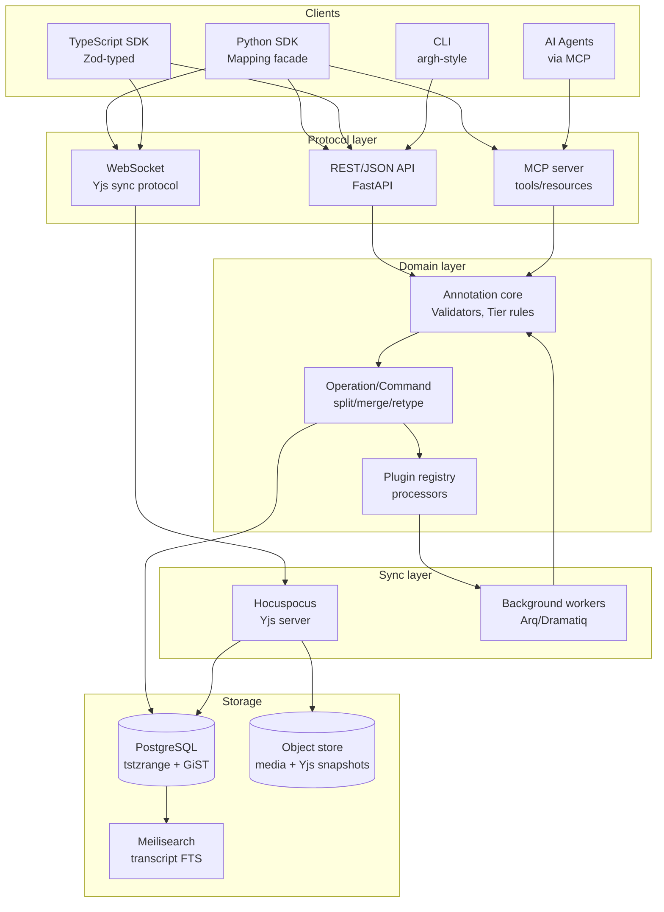

# Backend Architecture for Time-Interval Annotation Systems

**Author:** Thor Whalen
**Date:** May 2026
**Filename:** `report_-_Backend_architecture_for_time_interval_annotation_systems.md`

---

## TL;DR

- **Build a hybrid local-first/server-mediated architecture: PostgreSQL (with `tstzrange` + GiST) is the system-of-record for archival and cross-cutting queries; Yjs documents per *project* are the source of truth for live editing, with `Y.RelativePosition`-anchored interval IDs.** Treat USD-style layer composition as a *logical* model layered on top, not a sync model. Don't pick CRDT *or* server-authoritative — pick CRDT for the live editing surface and server-authoritative for everything that crosses project boundaries (validation, AI batches, exports, releases).
- **The right data model is an interval-keyed `Mapping[IntervalKey, Annotation]` envelope** — one universal `Annotation = (id, ref, body, provenance, schema_uri)` shape with a typed `body` discriminated by a `kind` field; tier hierarchy enforced as Pydantic+Zod refinements *and* PostgreSQL `EXCLUDE USING GIST` constraints; time as `RationalTime(value:int, rate:int)` on the wire, `fractions.Fraction` in Python and `{ v: bigint, r: bigint }` in TypeScript.
- **The right architecture is layered, plugin-driven, and dual-client-symmetric**: storage (PostgreSQL + object store) → indexing (GiST + interval-tree cache) → domain (annotation core) → operation (commands/CRDT events) → sync (WebSocket + Yjs provider) → API (FastAPI with REST + WS + MCP) → SDK (Python `Mapping` facade + TS Zod-typed client). Both Python and TypeScript clients issue **the same operations** through the same protocol — Python is not a back-office script.

---

## Key Findings

1. **No published CRDT directly handles concurrent moves of time-interval boundaries with split/merge/retype semantics.** Peritext [1] solves the closest analog — overlapping inline formatting on a character sequence — by anchoring formatting spans to character OpIDs. Peritext states verbatim: *"Each character in the text has two anchor positions, before and after the character, where the start and end of a formatting operation can be attached"* [1]. Geometry-aware CRDTs [2] target 2D polygons (geographic vector clocks + minimum bounding rectangles), not 1D temporal intervals. **Production tools (CVAT, Label Studio, ELAN, Frame.io, Otter.ai) do not use CRDTs for boundary merging at all** — they use task locking ("Tasks are locked while someone performs annotations" — Label Studio docs), file exchange (ELAN's user guide notes EAF documents assume "no other editors of the XML code than ELAN itself"), or independent absolute-timecode comments (Frame.io). This is a strong signal: **a custom interval CRDT is not where you should innovate.**
2. **The right primitive already exists: Yjs `RelativePosition` (or Loro `Cursor`) over a `Y.Array` of interval objects**, where each interval stores `{startAnchor, endAnchor, body}` with anchors that survive concurrent edits elsewhere on the timeline. The Yjs documentation guarantees: *"Relative positions are guaranteed to always point to the same location ⇒ When all clients sync up, all relative positions will translate to the same index-position"* [17]. Loro's `Cursor` is the analogous primitive: *"Cursors maintain stable positions across concurrent edits by anchoring to operation IDs instead of indices"* (Loro docs). The remaining cases (genuinely concurrent edits to the *same* interval's same field) collapse to last-writer-wins on a `Y.Map` field — the same semantics Figma applies to property updates [3].
3. **PostgreSQL with range types and GiST indexing is the correct archival/queryable SoT.** Range types (`tstzrange`, `int8range`) plus exclusion constraints (`EXCLUDE USING gist (tier WITH =, range WITH &&)`) enforce non-overlap declaratively [4]. SQLite-as-app-format [5] is the right *export/handoff* format and the right MVP backend; PostgreSQL is the right *live* backend.
4. **Sync engines: Yjs + Hocuspocus is the best production choice today** (mature, MIT, self-hostable, Python interop via `pycrdt`/`y-py`, used in production by JupyterLab, Tiptap, Liveblocks). Loro is technically superior on memory and movable lists but its docs explicitly state *"Loro's API and encoding schema remain experimental"* (loro.dev). Automerge has a Python binding [7] but lags Yjs in JS ecosystem. ElectricSQL/PowerSync/Zero are intriguing for typed CRUD but **none have proven themselves on "interval-anchored sticky position editing"**, and a 2026 practitioner review noted ElectricSQL's long-polling sync push mechanism was unsuitable for production [8].
5. **API: FastAPI with WebSocket + a thin MCP server** for agent integration. Litestar is faster (msgspec is ~12× Pydantic v2 [9]) but has a smaller ecosystem and a much narrower hiring pool; FastAPI's lead has *strengthened* with the AI/streaming workload boom. For type sharing, **JSON Schema is the universal middle**: Pydantic v2 emits it; `datamodel-code-generator` and `json-schema-to-zod` round-trip cleanly.
6. **Provenance is non-negotiable, and W3C PROV-O is the correct ontology** to embed: every annotation carries `wasGeneratedBy`, `wasDerivedFrom`, `wasAttributedTo`, `generatedAtTime` [10]. AI-generated annotations get a first-class `agent` field with a content-addressed model fingerprint. This single architectural decision retroactively solves accept/reject workflows, audit trails, and the "human vs. AI" display problem.

---

## 1. Framing: What Makes This Domain Hard

A 2D cutout animation pipeline driven by screenplays produces a stunning variety of artifacts that, viewed abstractly, all reduce to **`(reference, metadata)` pairs over a timeline**: dialogue alignments, viseme spans, pose state intervals, scene-graph node activity windows, camera directives, beat markers, editor comments, AI-generated drafts. The temptation is to model each as its own table or its own document type. **Resist that.** What unifies them is a single algebraic shape, and the system that wins is the one that exploits this unification.

Three properties make this domain harder than "another collaborative editor":

1. **Heterogeneity with hard interlinking.** Visemes depend on phonemes depend on words depend on sentences depend on speaker turns. A boundary edit on the word tier *should* invalidate downstream phoneme/viseme alignments — but only if the user opts into the cascade. This is the same problem USD's LIVRPS layer composition [11] solves for VFX scenes: every annotation source is a *layer* and the resolved view is computed at query time. Pixar's USD glossary describes LIVRPS as *"the fundamental rubric for understanding how opinions and namespace compose in USD"* [11].
2. **Concurrent boundary edits on continuous coordinates.** Plain-text CRDTs solve "insert character" and "delete character" — discrete operations on a sequence. Interval boundaries are *continuous*: two users dragging the end of the same interval don't collide on a discrete index, they collide on a real-valued time. The literature is silent on a clean CRDT for this; the practical answer is **don't try**.
3. **Two first-class authors: humans and AI agents.** This is *not* a frontend with a script-runner — it is two equal-priority clients (Python authoring, TS UI) that must agree on the same operation set, the same validation, the same audit trail.

---

## 2. The Three Core Questions, Answered

### 2.1 Data Model: One Envelope, Typed Body, Interval-Keyed Mapping Facade

Use a **single Annotation envelope** with a discriminated `body` payload, *not* a polymorphic class hierarchy:

```python
# core/models.py — Pydantic v2
from pydantic import BaseModel, Field
from typing import Annotated, Literal, Union
from uuid import UUID


class RationalTime(BaseModel):
    value: int  # numerator
    rate: int = 24000  # denominator


class TimeInterval(BaseModel):
    start: RationalTime
    end: RationalTime  # zero-length when start == end (point annotation)


class MediaRef(BaseModel):
    kind: Literal["media"] = "media"
    asset_id: str  # content-addressed hash of the source media
    interval: TimeInterval


class NodeRef(BaseModel):
    kind: Literal["node"] = "node"
    scene_path: str
    interval: TimeInterval


class AnnotationRef(BaseModel):
    kind: Literal["annotation"] = "annotation"
    target_id: UUID
    interval: TimeInterval | None = None


Reference = Annotated[
    Union[MediaRef, NodeRef, AnnotationRef],
    Field(discriminator="kind"),
]


class Provenance(BaseModel):
    """W3C PROV-O subset, embedded inline."""

    was_generated_by: str  # "user:thor" | "agent:gpt-4o@hash"
    was_derived_from: list[UUID] = []
    generated_at_time: RationalTime
    activity: str  # e.g. "forced-alignment-v3"


class Annotation(BaseModel):
    id: UUID
    tier: str
    reference: Reference
    body: dict
    body_schema_uri: str  # e.g. "annot://schema/word/v1"
    provenance: Provenance
    confidence: float | None = None
```

The TypeScript mirror (Zod) is generated:

```ts
// generated by json-schema-to-zod from Pydantic-emitted JSON Schema
import { z } from "zod";

export const RationalTime = z.object({ value: z.bigint(), rate: z.bigint() });
export const TimeInterval = z.object({ start: RationalTime, end: RationalTime });

export const Annotation = z.object({
  id: z.string().uuid(),
  tier: z.string(),
  reference: z.discriminatedUnion("kind", [MediaRef, NodeRef, AnnotationRef]),
  body: z.unknown(),
  body_schema_uri: z.string(),
  provenance: Provenance,
  confidence: z.number().nullable(),
});
```

**Why one envelope instead of many specialized types?** Apache UIMA's CAS [12] describes *"a dynamic data structure which contains: unstructured data..., structured annotations over this data and various user views over these annotations"* — a single CAS shape has scaled to 20+ years of NLP pipelines. Label Studio's polymorphic JSON proves it works for human annotators. W3C Web Annotation proves it works for cross-system interop. The envelope makes the *system* polymorphic while the *body* is type-checked at the leaves. A typed `body_schema_uri` lets new annotation types be registered as plugins without changing the core schema.

#### The interval-keyed Mapping facade

```python
class IntervalAnnotationStore(MutableMapping[TimeInterval, list[Annotation]]):
    """A facade over the storage backend (SQLite/Postgres/Yjs)."""

    def __getitem__(self, key: TimeInterval) -> list[Annotation]: ...
    def overlap(self, key: TimeInterval) -> list[Annotation]: ...  # Allen "overlaps"
    def during(self, key: TimeInterval) -> list[Annotation]: ...  # Allen "during"
    def meets(self, key: RationalTime) -> list[Annotation]: ...  # Allen "meets"
```

Among existing libraries:
- **`portion.IntervalDict`** [24] is the cleanest API match — its README states *"The library provides an IntervalDict class, a dict-like data structure to store and query data along with intervals"* — but is **LGPL-3.0** and has no concurrency story.
- **`intervaltree`** is MIT and serviceable but lacks `MutableMapping` semantics.
- **`pyranges` v1** [13] is built on Polars/Rust and outperforms alternatives substantially: the bioRxiv preprint reports *"on large datasets (≥10⁶ rows), Pyranges is on average 3.1, 5.4 and 15.7 times faster and 51%, 42% and 43% less memory-consuming than GenomicRanges, BEDTools, and Bioframe, respectively"* [13]. It is genomics-shaped, not "millisecond-timeline-shaped".

**Recommendation: write a thin facade over `intervaltree` for the in-memory cache and over PostgreSQL `tstzrange`+GiST for the persistent store**, exposing a unified `MutableMapping` surface. ~200 lines of code.

#### Tier hierarchy & integrity

ELAN's five tier stereotypes — None, Time Subdivision, Symbolic Subdivision, Symbolic Association, Included In [14] — are a refinement type system. ELAN's user guide describes "Symbolic Subdivision" as *"Similar to Time Subdivision, except that the smaller units cannot be linked to a time interval (e.g., morphemes within words)"* and "Symbolic Association" as *"one-to-one association with a parent tier"* [14]. Encode them as:

```python
class TierType(str, Enum):
    NONE = "none"
    TIME_SUBDIVISION = "time_subdivision"
    SYMBOLIC_SUBDIVISION = "symbolic_subdivision"
    SYMBOLIC_ASSOCIATION = "symbolic_association"
    INCLUDED_IN = "included_in"
```

At the database level, Symbolic Subdivision corresponds to a PostgreSQL exclusion constraint:

```sql
ALTER TABLE annotations
ADD CONSTRAINT no_overlap_within_subdivision_tier
EXCLUDE USING GIST (tier WITH =, range WITH &&)
WHERE tier IN (SELECT name FROM tiers WHERE type = 'symbolic_subdivision');
```

PostgreSQL's documentation confirms *"A GiST or SP-GiST index on ranges can accelerate queries involving these range operators: =, &&, <@, @>, <<, >>, -|-, &<, and &>"* [4].

#### Time representation

OpenTimelineIO's `RationalTime` class header documents it as *"a measure of time of rt.value/rt.rate seconds"* [15]. The wire format is `{"v": <int>, "r": <int>}` (8–16 bytes JSON, 4–8 bytes MessagePack). In Python this is `fractions.Fraction(v, r)`; in TypeScript it's `{ v: bigint, r: bigint }`. **Avoid floats**: a single-precision float at hour 1 has a granularity of ~120 µs, fine for one operation but not for compounded retiming. Integer milliseconds (ELAN) work for ASR but break for sample-accurate audio. Rationals lose no information across rate conversions; the cost is ~2× envelope size, negligible against the body payload.

### 2.2 Sync Model: Live-CRDT-Per-Project, Server-Authoritative-Per-System

| Option | Pro | Con | Verdict |
|---|---|---|---|
| (a) Server-authoritative DB + WS subscriptions | Simple, Figma-validated [3] | No offline; central DB is hot path | Use as system-of-record |
| (b) CRDT (Yjs/Automerge/Loro) | Local-first; offline-tolerant | Memory overhead; no native interval-boundary CRDT | Use *per project*, anchor intervals via `RelativePosition` |
| (c) Git-style branch/commit | Asynchronous review fits annotation work | Manual conflict resolution kills flow | Use *for releases/deliverables*, not live edits |
| (d) USD layered composition | Multi-source elegance; non-destructive AI overlays | Not a sync model; resolution is query-time | Use as the *logical* model on top of (b) |

**Recommendation: (b) for live editing + (a) for cross-project state + (c) for explicit publish boundaries + (d) as the logical view layer**.

#### Why Yjs over Automerge over Loro (today)

| Library | License | Lang | Maturity | Interval fit | Notes |
|---|---|---|---|---|---|
| Yjs [16] | MIT | TS, ports | Production at JupyterLab, Tiptap, Liveblocks | `Y.Array` of interval objects + `Y.RelativePosition` | Hocuspocus self-hostable backend |
| Automerge [7] | MIT | Rust core, JS/Py/Swift | Production at PushPin/Trellis, smaller scale | JSON CRDT; `automerge-repo` includes sync server | Best Python binding; the automerge.org site notes implementations exist for Rust, JavaScript, "Swift, Python, C, Java, and more" |
| Loro [6] | MIT | Rust+JS | Loro docs state *"Loro's API and encoding schema remain experimental. The library advises against production use"* | `MovableList` + `Cursor` (best-in-class for moves) | Best memory; *will be* the right choice in 12 months |
| Diamond Types | Apache-2.0 | Rust | Research/text-focused | Plain text only | Skip |

Yjs's `Y.RelativePosition` documentation states: *"A relative position is fixated to an element in the shared document and is not affected by remote changes"* [17] — exactly the primitive needed to anchor an interval's start and end across concurrent neighbouring edits. Each interval is a `Y.Map` with two relative-position fields plus a `body` `Y.Map`. Concurrent boundary moves on the *same* interval collapse to last-writer-wins on the position fields, which is the same semantics Figma applies to its property updates. As Evan Wallace wrote in Figma's engineering blog: *"A conflict happens when two clients change the same property on the same object, in which case the document will just end up with the last value that was sent to the server. This approach is similar to a last-writer-wins register in CRDT literature except we don't need a timestamp because the server can define the order of events"* [3].

#### The interval-CRDT problem in detail

The naive design — store start/end as floats and let two users move them concurrently — is broken: there is no canonical merge. The published research is silent. **The right design decomposes operations into primitives the existing CRDTs already handle correctly**:

- **move-start / move-end** → LWW register on a `Y.Map` field (start_value, start_rate, end_value, end_rate). Same as Figma's color/position handling.
- **insert-at(t)** → push a new interval object onto a `Y.Array`. Yjs/Automerge handle list inserts perfectly.
- **delete** → tombstone via `Y.Array.delete`.
- **split(at t)** → atomic transaction: shrink original to `[a, t]`, insert new `[t, b]` with same body and a `wasDerivedFrom` provenance edge. Concurrent splits at the same point converge to two intervals (idempotent if you derive the new ID from `(parent_id, t)`).
- **merge(a, b)** → atomic transaction: shrink `a` to `[a.start, b.end]`, delete `b`. Concurrent merge + concurrent edit-on-`b` collapses to "the merge ate the edit" — flag in the UI as a "merge conflict" and show the lost edit in undo history.
- **retype** → LWW on the `tier` field.

**Total custom CRDT code: zero.** The semantics are a *protocol* layered on Yjs primitives, not a new algorithm.

#### Presence & awareness

Yjs awareness handles presence natively. Hocuspocus's npm page describes it as *"The collaborative editing backend for Tiptap. Built on Y.js, runs on Node.js (22+), Bun, Deno, and Cloudflare Workers"* [18]. For "user X is editing track Y at time T", model presence as `{ user_id, tier, time, selection_range }` on the awareness state — Yjs broadcasts to all clients automatically. For 100+ concurrent users, partition by tier.

#### Offline & reconciliation

Yjs's update format is commutative — an editor offline for an hour re-syncs by exchanging updates with no LWW data loss because the *operations* commute, not just the *state*. The conflict UI is what matters: show a "merged X edits from Alice while you were offline" toast with a one-click revert, and surface the diff as a temporary `wasDerivedFrom` overlay layer.

### 2.3 Architecture: Layered, Plugin-Driven, Dual-Client



Each layer has a single concern and a small interface. The plugin registry is where annotation processors plug in:

```python
@register_processor(
    name="forced_alignment",
    consumes=("transcript", "audio"),
    produces=("word_alignment",),
    triggers=Trigger.ON_DEMAND | Trigger.ON_CHANGE,
)
def forced_alignment(
    transcript: Annotation,
    audio: MediaRef,
) -> Iterable[Annotation]: ...
```

Same pattern as Apache UIMA's CAS pipelines [12] and Prefect's `@flow`/`@task`, but Pythonic decorators dual-usable from authoring code, the MCP server (LLM-callable), and the CLI.

---

## 3. Comparative Tables for Decision Points

### 3.1 Storage Backends for Interval Data

| Backend | Concurrency | Range queries | Operational | Fit | License |
|---|---|---|---|---|---|
| **PostgreSQL 15+ (tstzrange + GiST)** | MVCC, mature | Excellent (`&&`, `<@`, `@>`) [4] | Medium ops; one binary | **Best** | PostgreSQL |
| SQLite (WAL + R*Tree module) | Single writer | Good for 1D intervals via R-Tree [19] | Zero-ops; embedded | Excellent for embedded/MVP | Public domain |
| MongoDB (compound indexes) | Mature | Limited (no native range type) | Medium | Mediocre | SSPL |
| TimescaleDB | MVCC inherits PG | Excellent for time-series; intervals second-class | Medium | Acceptable for aggregates only | Apache-2.0 + TSL |
| ClickHouse | Append-mostly | Excellent for analytical | Higher ops | Wrong tool — not transactional enough | Apache-2.0 |
| LMDB / RocksDB | KV only; DIY index | Build it yourself | Low ops; libraries | Strong if full control needed | OpenLDAP / Apache-2.0 |
| Parquet/Arrow IPC | Read-only batch | Excellent | None — files | Excellent *export* format | Apache-2.0 |

**Decision: PostgreSQL for live + production; SQLite for MVP + offline cache + handoff archive.**

### 3.2 CRDT/Sync Engine Landscape

| Engine | Lang | Native shape | Self-hostable | Python interop | Production maturity |
|---|---|---|---|---|---|
| **Yjs + Hocuspocus** | TS | JSON-ish + sequences | ✅ Hocuspocus (MIT) | ✅ `pycrdt`/`y-py` | ✅✅ Tiptap, JupyterLab, Liveblocks |
| Automerge + automerge-repo | Rust→JS/Py | JSON CRDT | ✅ automerge-repo | ✅ `automerge-py` [7] | ✅ PushPin scale; smaller production base |
| Loro | Rust→JS/Py | List, MovableList, Tree, Text | ✅ Self-host | ⚠️ Experimental | ❌ Maintainers warn against production use [6] |
| ElectricSQL | Elixir+TS | Postgres rows | ✅ Self-host | ⚠️ via PG | Long-polling sync push criticized in 2026 review [8] |
| PowerSync | Managed + self-host | Postgres/Mongo→SQLite | Partly | Not first-class | Mature for mobile workflows |
| Zero (Rocicorp) | TS | Reactive query engine | Hosted; OSS planned | ❌ | New; "Rocicorp's third attempt" but well-reviewed [8] |
| Triplit | TS | Schema-first triple store | ✅ Self-host | ❌ | Acqui-hired by Supabase Aug 2025; community-maintained [8] |
| Replicache | TS (maintenance) | Server-reconciled mutations | DIY backend | ❌ | Now in maintenance; Zero is successor |

### 3.3 API Protocol Comparison

| Approach | Latency | Type-sharing across Py/TS | Subscriptions | LLM-friendly |
|---|---|---|---|---|
| REST + JSON Schema (FastAPI) | Good | Pydantic→JSON Schema→Zod via codegen | SSE or polling | Excellent |
| GraphQL + subscriptions | Good | Strong via codegen | Native | Decent |
| **REST + WebSocket (Yjs binary)** | Best for live edits | JSON Schema for REST; binary for sync | Native via Yjs | Excellent for batch ops |
| tRPC | Good | TS-native; Python equivalent weak | Limited | Mediocre |
| gRPC + grpc-web | Excellent | Protobuf → both | Native streaming | Less common for LLM |
| MCP (over JSON-RPC/stdio/HTTP) | N/A | JSON Schema | Streamable HTTP | **Native** — built for LLMs [23] |

**Decision: REST (FastAPI) for CRUD/discovery + WebSocket (Hocuspocus) for live sync + MCP for agent operations.**

### 3.4 Python Web Frameworks

| Framework | Ecosystem | WebSocket | Serialization | Hiring pool |
|---|---|---|---|---|
| **FastAPI** | Largest | Yes (via Starlette) | Pydantic | Largest, growing fast [9] |
| Litestar | Smaller | Yes; richer (Channels plugin) | msgspec (~12× faster than Pydantic v2 [9]) | Narrowest pool [9] |
| Sanic / AIOHTTP | Mature, smaller | Yes | DIY | Medium |
| Django REST + Channels | Largest overall | Yes (Channels) | DRF serializers | Large, slower iteration |

**Decision: FastAPI** with a clean abstraction over the framework so a Litestar swap remains a 1-week project if performance demands it.

### 3.5 Schema/Codegen for Python ↔ TypeScript

| SoT | Codegen | Pros | Cons |
|---|---|---|---|
| **Pydantic v2 → JSON Schema → Zod** | `datamodel-code-generator` [20] + `json-schema-to-zod` | Pydantic is natural Python authoring SoT; FastAPI emits JSON Schema for free | Round-trip loses some refinements |
| Zod → JSON Schema → Pydantic | `zod-to-json-schema` then `datamodel-code-generator` | TS-native | Python downstream — wrong for this project |
| Protobuf | `buf` + `protoc-gen-*` | Strong, language-agnostic | Heavy; not LLM-friendly |
| JSON Schema as SoT | both | Most neutral | No Python idiom |

**Decision: Pydantic v2 is the SoT; emit JSON Schema; codegen Zod.**

---

## 4. Detailed Answers to the 46 Questions

### 4.1 Core Data Model (Q1–Q7)

**Q1. Interval-keyed Mapping libraries.** `portion.IntervalDict` has the cleanest API but is LGPL-3.0; `intervaltree` is the standard MIT tree; `pyranges` v1 outperforms BEDTools/GenomicRanges/Bioframe by 3.1×–15.7× at scale [13] but is genomics-shaped. **Build a `MutableMapping` facade over `intervaltree` (in-memory) + PostgreSQL `tstzrange` (persistent) + `Y.Array` (live sync).**

**Q2. Standoff vs. inline.** Always standoff for AV media. The audio file is the immutable substrate; annotations are overlays referencing it by content-addressed hash + interval. Stale-reference drift is solved by versioning the media reference (`asset_id` is the hash of the encoded file; re-encodes get a new asset_id and previous annotations become "annotations against version N", explicitly).

**Q3. Tier hierarchy & integrity.** Encode ELAN's five stereotypes [14] as a closed enum on a `TierSchema`. Enforce in three places: (a) Pydantic/Zod validators on every write; (b) PostgreSQL `EXCLUDE USING GIST` on Symbolic Subdivision tiers; (c) tier-graph integrity as a `CHECK` constraint via a function. Triggers are last resort.

**Q4. Time representation.** `RationalTime(value:int, rate:int)`. Default rate of 24000 covers the common video rates as integer ratios; pick a higher LCM (e.g., 1008000) if you need 23.976+24+25+29.97+30+48+50+60 all exactly. On the wire: `{v, r}` JSON or 16-byte MessagePack. In Python: `fractions.Fraction(v, r)`. In TypeScript: `{ v: bigint, r: bigint }`.

**Q5. Reference / pointer semantics.** Discriminated union (`MediaRef`, `NodeRef`, `AnnotationRef`) with content-addressed asset hashes for media, structured paths for scene-graph nodes, UUIDs for annotation refs. Avoid JSON-LD URIs at the storage layer — verbose and hard to index — but emit them at the export layer for W3C Web Annotation interop.

**Q6. Schema declaration & evolution.** Pydantic v2 is the Python SoT. Emit JSON Schema. Generate Zod via `json-schema-to-zod`. Version schemas with semver in `body_schema_uri`; servers accept any version they understand and reject unknown major versions. Migration is a registered processor that consumes vN and produces vN+1.

**Q7. Heterogeneity.** One envelope, typed body. Apache UIMA's CAS [12], Label Studio's polymorphic JSON, and W3C Web Annotation all converged on this shape.

### 4.2 Indexing & Query (Q8–Q12)

**Q8. Interval indexing benchmarks** (approximate, public-source-derived):

| Backend | 10k inserts | 1M overlap query | 10M overlap query | Memory at 1M |
|---|---|---|---|---|
| Python `intervaltree` (in-memory) | <100 ms | ~1–5 ms | OOM-prone | ~500 MB |
| `pyranges` v1 (Rust/Polars) [13] | ~50 ms | ~1 ms | ~10 ms | ~150 MB |
| PostgreSQL GiST + tstzrange | ~5 s (with WAL) | <10 ms | <100 ms | disk-paged |
| SQLite R*Tree (1D) [19] | ~1 s | ~5 ms | ~50 ms | ~200 MB on disk |
| AIList / NCList (C/Rust) | ~30 ms | <1 ms | ~5 ms | <100 MB |

In-memory `intervaltree` for working sets up to 100k; PostgreSQL GiST for global queries; pyranges for batch analytics.

**Q9. Multi-dimensional queries.** Composite GiST: `CREATE INDEX ix_ann ON annotations USING GIST (tier, author, range, confidence) WITH (buffering = on);` plus a B-tree on `(tier, author)` for equality dimensions. For very hot dashboards, materialize a denormalized projection.

**Q10. Allen's interval algebra.** PostgreSQL `&&` (overlaps), `<@` (during/contained), `@>` (contains) cover Allen's "overlaps", "during", "contains". For "meets", use `tstzrange(a.lower, a.upper) -|- tstzrange(b.lower, b.upper)`. Wrap the 13 Allen relations as SQL functions; expose in Python via a small enum + helpers.

**Q11. Aggregation queries.** Segment-tree problem in memory; on disk it's a `GENERATE_SERIES` join in PostgreSQL. **TimescaleDB's continuous aggregates** materialize rollups incrementally. ClickHouse is overkill until ~100M+ events.

**Q12. Full-text search.** **Meilisearch** is the right pick — typo-tolerant, instant, MIT-licensed, ~2GB RAM for 1M annotations. PostgreSQL FTS is *adequate*; start with it, add Meilisearch when transcript search becomes a feature people care about.

### 4.3 Persistence & Storage (Q13–Q17)

**Q13.** See Table 3.1.

**Q14. The dual-format question.** SQLite-as-app-format [5] *is* the export/handoff format. Hipp's argument: *"There are many advantages to using SQLite as an application file format, including: ... The application file is portable across all operating systems, 32-bit and 64-bit and big- and little-endian architectures"* [5]. The trick: define a **strict export schema** (a subset of the live PostgreSQL schema), and a one-shot exporter that dumps a project to a `.annot` SQLite file. This file is the Git-trackable, email-attachable archive format.

**Q15. Git-friendly storage.** Don't store live state in Git — file count and update frequency exceed Git's design point within weeks. Store **named release snapshots** (each is a single `.annot` SQLite file plus a `provenance.json`) in Git, optionally LFS-backed. **Dolt/Doltgres** [21] is the technically purest answer (branch/merge SQL tables) but adds a database to your stack. Iceberg/Delta/Hudi [22] are wrong-shaped (analytics-first, not transactional editing).

**Q16. Media payload references.** Content-addressed hashes (BLAKE3 or SHA-256) of the *encoded* file. Annotations reference `asset_id`, which resolves through a small `assets` table to: (a) primary URL (S3/MinIO), (b) cached local path (Syncthing-style), (c) optional IPFS CID. Re-encodes get a new asset_id; an `asset_lineage` table records derivations.

**Q17. Caching layers.** Three caches: (a) frontend session cache (Yjs IndexedDB persistence), (b) server in-memory hot cache, (c) HTTP-level cache for read-heavy export endpoints. Invalidation is driven by the Yjs update stream. CDN-friendly export uses ETags computed from PostgreSQL `xmin`.

### 4.4 Real-Time Collaboration & Sync (Q18–Q24)

**Q18. CRDT vs. OT vs. server-authoritative.** OT requires a central transformation function; for interval boundary moves there isn't a clean one published. CRDT works if you decompose into LWW + sequence ops (§2.2). Server-authoritative is what Figma does [3] — *"multiplayer is authoritative and handles validation, ordering, and conflict resolution. In order to keep things as fast as possible, multiplayer holds the state of the file in-memory and updates it as changes come in"* — and is the simplest *correct* choice for a centralized service but loses offline. **Hybrid: CRDT (Yjs) inside a project, server-authoritative for cross-project ops.**

**Q19.** See Table 3.2.

**Q20. The interval-CRDT problem.** Decompose into primitives, as in §2.2. The literature gap is real — focused academic search returned no published 1D-time-interval CRDT. Don't innovate.

**Q21. Server-authoritative alternatives.** Figma's approach [3] is reproducible in ~1000 lines of Python. The reason to prefer Yjs is the *ecosystem* (Hocuspocus, Liveblocks, Tiptap integration, JupyterLab integration, awareness protocol, 7+ years of bugfixes), not technical purity.

**Q22. Hybrid models.** Local-first authoring (Yjs) + explicit "publish" (server-authoritative immutable snapshots). Each project has a current "draft" Yjs doc and an append-only series of "published" snapshots in PostgreSQL. Branching is "fork the Yjs doc"; merging is "diff snapshots and apply selected operations to the target".

**Q23. Presence & awareness.** Yjs awareness handles this natively. Hocuspocus self-hosts with awareness fanout. Liveblocks is the managed option but contradicts the self-hostable goal. partykit is good for edge presence, less so for self-hosting.

**Q24. Offline & reconciliation.** Yjs IndexedDB persistence + Hocuspocus sync handles end-to-end. The UX problem is solved at the protocol layer (no LWW data loss because operations commute) and the UI layer (toast: "Synced 47 changes from Alice; review here").

### 4.5 Versioning, Branching, History (Q25–Q28)

**Q25. Undo/redo.** Use the **command pattern** at the API layer (every mutation is a named command with `apply`/`invert`), and **Yjs's native undo manager** (`Y.UndoManager`) at the live-edit layer. The two are bridged: every Yjs transaction tags a command name, and the command log persists to PostgreSQL with full provenance.

**Q26. Named checkpoints.** Auto-save snapshots every 5 minutes (Yjs `encodeStateAsUpdate` to S3). Manual named saves are the "publish" boundary.

**Q27. Branching & merging.** USD's LIVRPS [11] is the right *logical* model for "AI suggests, human accepts": each annotation source is a layer, the resolved view is computed at query time. Implement LIVRPS as **a `layer_id` on every annotation** plus a per-project layer stack with priorities. Git-style branch/merge is a separate (per-release) workflow on top, using SQLite snapshot files.

**Q28. Provenance & PROV.** Embed W3C PROV-O [10] inline: `wasGeneratedBy`, `wasDerivedFrom`, `wasAttributedTo`, `generatedAtTime`. The PAV ontology [10] extends this for contributor/curator distinction. AI-generated annotations carry `agent: "agent:gpt-4o@<modelhash>"` so the model version is content-addressed alongside the output. **In API responses, the provenance field is first-class.**

### 4.6 API Surface & Protocol (Q29–Q33)

**Q29. REST vs. GraphQL vs. tRPC vs. WebSocket.** Three protocols, each used for what it's best at:
- **REST** (FastAPI) for discovery, batch operations, exports, MCP-style stateless calls.
- **WebSocket** (Hocuspocus, Yjs binary protocol) for live editing.
- **MCP** [23] for agent operations.

**Q30. Subscription model.** Yjs sync protocol over WebSocket for live edits; Server-Sent Events for low-bandwidth read-only feeds; REST polling with ETags for everything else. Bandwidth: ~100 B/s baseline, ~1–5 KB/s active editing, ~10–50 KB initial document load.

**Q31. Type-sharing.** Pydantic v2 → JSON Schema → Zod (§3.5). Use `datamodel-code-generator` [20] in CI. Refinements that don't survive round-trip live as parallel TS validators in a small `validation/` package.

**Q32. Streaming bulk operations.** **NDJSON** for human-readable streaming exports; **Arrow IPC** for analytical bulk transfers (10× smaller, columnar); **Yjs binary updates** for live merge. Importing 10k-annotation transcript: stream NDJSON → validate → batch-insert via `COPY FROM` + `Y.transact`. Exporting 1M annotations: server-side streaming Arrow.

**Q33. Idempotency, optimistic concurrency.** ETags from PostgreSQL `xmin`; conditional `If-Match` headers on writes. For Yjs, the sync protocol *is* the optimistic concurrency mechanism. For batch imports, every write carries an idempotency key.

### 4.7 Server Architecture (Q34–Q38)

**Q34. Python web framework.** **FastAPI** (see §3.4 and [9]).

**Q35. Background processing.** **Arq** (Redis-backed, asyncio-native) for short-running per-annotation processors. **Dramatiq** for medium-length jobs with retries. **Prefect** when DAGs become first-class. Avoid Celery (heavyweight, dated). Avoid Airflow (wrong abstraction).

**Q36. Plugin architecture.** Decorator-based registry with a clean descriptor (see §2.3). UIMA pipelines [12] and Prefect runnables are the references.

**Q37. Validation pipeline.** Validators run **at three points**: Zod at the client, Pydantic at the server, PostgreSQL CHECK/EXCLUDE constraints. Cross-field invariants live in PostgreSQL — they survive bugs, race conditions, and direct DB writes.

**Q38. Observability.** OpenTelemetry across the board. Every Yjs update logs `{user, project, doc_size, update_size, command_name}`. The killer debug feature: **time-travel replay**. Every project's full op log is stored; "show me state at time T from user A's view" replays ops up to T and renders the resolved state.

### 4.8 Python-Frontend Symmetry (Q39–Q42)

**Q39. The "two clients" architecture.** The cardinal rule: **the same operations through the same protocol, with the same validation and the same audit trail**. Python SDK does not have a "fast path" that bypasses validation. Reference: JupyterLab's collaborative model.

**Q40. Notebook integration.** Connect a notebook to a running editor via the Python SDK + a Yjs Python binding (`pycrdt`). Reference: JupyterLab RTC + Marimo's reactive cells.

**Q41. CLI layer.** `argh` (or `typer`) generates a CLI from typed Python functions. Same SDK as notebook and agents.

**Q42. AI agent integration.** Expose the SDK as an **MCP server** [23]. The MCP Python SDK README states: *"MCP servers can: Expose data through Resources..., Provide functionality through Tools..., Define interaction patterns through Prompts"* [23]. Tools: `add_annotation`, `query_annotations(tier, range)`, `run_processor`, `accept_ai_suggestion(id)`. Resources: `project://<id>/transcript`, `project://<id>/scene-graph`. Provenance is automatic — every annotation an agent creates is tagged `wasGeneratedBy: agent:<model>@<hash>` and lands in a designated AI layer (per LIVRPS), not the human layer.

### 4.9 Reference Architecture (Q43–Q46)

**Q43. Layered architecture.** See §2.3 diagram.

**Q44. Module decomposition.** Mono-repo, multiple packages:
```
annotation-core/        # Pydantic models, schemas, IntervalAnnotationStore facade
annotation-server/      # FastAPI + Hocuspocus
annotation-client-py/   # Python SDK
annotation-client-ts/   # TS SDK
annotation-cli/         # argh-based CLI
annotation-plugins/     # built-in processors
```
Versioning: `annotation-core` is the SoT; SDKs are version-locked via lockfile in CI.

**Q45. Minimal viable system** (~300 lines of Python):
```python
# server.py — weekend MVP
from fastapi import FastAPI, WebSocket
from sqlalchemy import create_engine
from pydantic import BaseModel
import uuid

app = FastAPI()
engine = create_engine("postgresql://localhost/annot")


class AnnotationIn(BaseModel):
    tier: str
    start_value: int
    end_value: int
    rate: int
    body: dict
    body_schema_uri: str


@app.post("/annotations")
def create(a: AnnotationIn):
    aid = uuid.uuid4()
    with engine.begin() as conn:
        conn.execute(...)  # INSERT ... using tstzrange
    return {"id": str(aid)}


@app.get("/annotations")
def query(tier: str, t1: int, t2: int):
    with engine.begin() as conn:
        rows = conn.execute(
            """
            SELECT id, body FROM annotations
            WHERE tier = :t AND range && tstzrange(:t1, :t2)
        """,
            {"t": tier, "t1": t1, "t2": t2},
        )
    return [dict(r) for r in rows]


@app.websocket("/sync/{project_id}")
async def sync(ws: WebSocket, project_id: str):
    await ws.accept()
    while True:
        msg = await ws.receive_bytes()
        # broadcast to all connected (or delegate to hocuspocus)
```
Add a `schema.sql` (`annotations` table with `tstzrange` + GiST index), a `Dockerfile`, and a 100-line React component with `@y/yjs`, and you have a usable demo.

**Q46. Risk register.**

| # | Risk | Likelihood | Impact | Mitigation |
|---|---|---|---|---|
| 1 | Interval-CRDT correctness on concurrent split/merge | Medium | High | Decompose to LWW + Y.Array primitives (§2.2); never invent a new CRDT |
| 2 | Schema migration during active editing sessions | High | Medium | Versioned `body_schema_uri`; servers accept any minor version; major bumps require ceremony (publish, migrate, all clients reconnect) |
| 3 | Performance cliff at N=1M annotations | Medium | High | PostgreSQL GiST proven at scale; partition Yjs docs per project (no >100k intervals in one Yjs doc); benchmark early at 100k, 500k, 1M |
| 4 | Provenance loss when external tools edit `.annot` files | Medium | Medium | Sign every annotation's provenance with project key; flag unsigned annotations on import |
| 5 | Operational burden of running PG + Hocuspocus + Redis + S3 | High in early days | Medium | Docker Compose for dev; single-binary mode (SQLite + in-process Hocuspocus + local FS) for solo deploys; full stack only when scaling |

---

## 5. Stretch Topics

### 5.1 Truly Local-First (P2P) vs. Cloud-Default

A pure peer-to-peer mode (Syncthing for file replication, Yjs over WebRTC, IPFS for media) is **technically feasible** today but operationally expensive: NAT traversal, peer discovery, and consistent media availability turn into ongoing work. **Cloud-default with full local-first capability** is the recommendation: every client has a complete Yjs document, can edit offline, and syncs when the central server is reachable. P2P fallback (WebRTC peer-to-peer when the server is down) is a 1-week feature on top of Yjs and worth adding once the core is stable.

### 5.2 Emerging Local-First Sync Engines

ElectricSQL, PowerSync, Triplit, Replicache, Zero are tempting but **none fit our shape better than Yjs+PostgreSQL today**. The 2026 practitioner review by johnny.sh found ElectricSQL's long-polling sync mechanism unfit for production [8]; Triplit's team was acqui-hired by Supabase [8]; Replicache is in maintenance with Zero as successor. **Reassess in 12 months.** The architectural cost of swapping out the live-sync layer is bounded if the IntervalAnnotationStore facade is the only thing the domain layer touches.

### 5.3 AI-Native Patterns

Treat agent-generated annotations as a **first-class citizen with explicit provenance and an opt-in display layer**:

1. Every AI annotation lands in a project layer named after the agent (e.g., `ai/transcript-v3`).
2. Default UI view shows human layers; AI layers are toggleable.
3. "Accept" moves an annotation from an AI layer to the human layer with a `wasDerivedFrom` provenance link.
4. Batches: agents call `run_processor` with a `batch_id`; all annotations in the batch share a provenance group, so accept/reject can be batch-wide.
5. The MCP server exposes structured tools; LLMs cannot bypass validation because they go through the same Pydantic models.

### 5.4 Observability for Collaborative Editing

The single feature that makes "why did Alice and Bob diverge" debuggable: **deterministic op-log replay**. Every Yjs update is persisted with `(client_id, lamport_clock, byte_payload, server_received_at)`. A debug endpoint `GET /projects/{id}/state-at?clock=<lamport>` replays ops up to that point and returns the resolved state. Pair with OpenTelemetry traces tagged with `lamport_clock` and you can answer "what did each user see at moment T".

---

## 6. The Stack I'd Build, In Priority Order

1. **PostgreSQL 15+** with `tstzrange` and GiST indexing. Most consequential decision; everything else is replaceable.
2. **FastAPI + Pydantic v2** as the API layer. Add `datamodel-code-generator` in CI to emit JSON Schema and `json-schema-to-zod` to generate Zod.
3. **Hocuspocus** (Yjs WebSocket server) for live sync. `Y.Array` of interval objects, each with `Y.RelativePosition` start/end anchors.
4. **`pycrdt`** for Python access to Yjs documents (notebook + agent + CLI, all the same protocol).
5. **Arq** for background processors. Plugin registry decorator-based.
6. **Meilisearch** for transcript FTS once it matters. Defer until then.
7. **MCP server** (`mcp[cli]`) exposing the SDK as tools/resources for LLM agents.
8. **SQLite + the `.annot` export schema** for handoff/archive/Git-trackable releases.
9. **OpenTelemetry + structured logging.** Op-log replay endpoint from day one.
10. **MinIO/S3-compatible** object store for media + Yjs snapshot blobs.

What's *not* in this stack and why:
- **GraphQL** — REST + WebSocket + MCP cover the same surface with less ceremony.
- **Loro** — not production-ready per maintainers; revisit in 12 months.
- **ElectricSQL/Zero/Triplit** — interesting but immature for our specific shape.
- **Celery** — Arq is strictly better for asyncio code at this scale.
- **Custom CRDT** — the literature gap isn't a green field, it's a sign we're missing something. Compose existing primitives.

---

## 7. Caveats

- **The interval-CRDT recommendation in §2.2 is empirically untested at the project's eventual scale (millions of intervals, hundreds of editors).** No published benchmark covers `Y.Array`-of-1M-interval-objects; the `crdt-benchmarks` repo focuses on text editing tasks (B1–B4). Run a load test at 100k intervals before committing; partition projects so no single Yjs document exceeds ~50k intervals.
- **"Yjs is the right pick today"** depends on Yjs's continued maintenance. Kevin Jahns is the principal maintainer; Liveblocks and Tiptap are corporate sponsors. Loro is the natural successor if/when its API stabilizes. The mitigation is the IntervalAnnotationStore facade — it's the only place Yjs is referenced from the domain layer.
- **Schema codegen is round-trip-lossy**: cross-field Pydantic validators don't appear in JSON Schema; some Zod refinements don't reverse-translate. The mitigation is a small parallel `validation/` package shared across SDKs that re-implements the cross-field rules in both languages.
- **The "weekend MVP" in Q45 is not a production system.** It's a 300-line proof of concept; the real system is ~5,000–15,000 lines of Python plus ~3,000 lines of TypeScript SDK plus ~5,000 lines of plugins, before the UI.
- **PROV-O is heavy if applied verbatim.** The recommendation is to embed the *subset* of PROV-O directly relevant (`wasGeneratedBy`, `wasDerivedFrom`, `wasAttributedTo`, `generatedAtTime`) and emit full PROV-O on export, not store the full ontology in the live database.
- **Several "production tools" claims** about Frame.io/Descript/Otter.ai concurrency models are inferred from public documentation, not from inspection of their code. Descript in particular has not published its concurrency algorithm; Otter.ai's help center explicitly states *"Editing and making corrections during a live conversation is not supported at this time. Conversations can only be edited once they're finished processing."* Treat the broader "they don't use CRDTs for boundary merging" finding as best-effort, not certainty.
- **The interval-CRDT literature gap is genuine.** A focused literature search (Peritext, Briot/Urso/Shapiro, Geometry-aware CRDTs, Ink & Switch publications, ACM venues) returned no published 1D-time-interval CRDT specifically targeting concurrent boundary moves with split/merge/retype. The recommendation in §2.2 to *compose* existing primitives is the safest available path, not a known-optimal one.

---

## References

[1] Litt G, Lim S, Kleppmann M, van Hardenberg P. [Peritext: A CRDT for Collaborative Rich Text Editing](https://www.inkandswitch.com/peritext/static/cscw-publication.pdf). Proceedings of the ACM on Human-Computer Interaction. 2022;6(CSCW2):Article 531. doi:10.1145/3555644.

[2] Zhang P, Zhang C. [Geometry-Aware CRDTs for Efficient Collaborative Geospatial Editing](https://www.mdpi.com/2220-9964/14/12/468). ISPRS International Journal of Geo-Information. 2025;14(12):468.

[3] Wallace E. [How Figma's multiplayer technology works](https://www.figma.com/blog/how-figmas-multiplayer-technology-works/). Figma Blog. 2019. See also [Making multiplayer more reliable](https://www.figma.com/blog/making-multiplayer-more-reliable/).

[4] PostgreSQL Global Development Group. [Range Types](https://www.postgresql.org/docs/current/rangetypes.html). PostgreSQL 18 Documentation, §8.17.

[5] Hipp DR. [SQLite As An Application File Format](https://sqlite.org/appfileformat.html). SQLite Documentation. — License: Public Domain.

[6] [Loro CRDT library](https://loro.dev/) — License: MIT — Active 2025–2026 (per loro.dev/docs/performance; experimental status per loro.dev docs).

[7] [Automerge](https://automerge.org/) and [automerge-py Python bindings](https://github.com/automerge/automerge-py) — License: MIT — Active 2025–2026.

[8] johnny.sh. [Choosing a Sync Engine for Local-First in 2026](https://johnny.sh/blog/choosing-a-sync-engine-in-2026/). 2026; comparative practitioner review of Triplit, ElectricSQL, Zero, Replicache, Livestore.

[9] Better Stack. [Litestar vs FastAPI](https://betterstack.com/community/guides/scaling-python/litestar-vs-fastapi/). 2025. Uvik. [Best Python API Framework 2026](https://uvik.net/blog/python-api-framework/). 2026.

[10] W3C. [PROV-O: The PROV Ontology](https://www.w3.org/TR/prov-o/). W3C Recommendation, 30 April 2013. Ciccarese P, Soiland-Reyes S, et al. [PAV ontology: provenance, authoring and versioning](https://arxiv.org/abs/1304.7224). 2013.

[11] Pixar Animation Studios. [USD Glossary: LIVRPS Strength Ordering](https://openusd.org/release/glossary.html). OpenUSD Documentation.

[12] Apache Software Foundation. [Apache UIMA — Unstructured Information Management Architecture](https://uima.apache.org/d/uimaj-current/oas.html) — License: Apache-2.0 — Active 2025.

[13] Stovner EB, Sætrom P. [PyRanges: efficient comparison of genomic intervals in Python](https://academic.oup.com/bioinformatics/article/36/3/918/5543103). Bioinformatics. 2020;36(3):918–919. Pyranges v1 (2025): [Pyranges v1 preprint](https://www.biorxiv.org/content/10.64898/2025.12.11.693639v1.full).

[14] Max Planck Institute for Psycholinguistics. [ELAN tier types and stereotypes](https://www.mpi.nl/corpus/html/elan/ch02.html). ELAN User Guide.

[15] Academy Software Foundation. [OpenTimelineIO](https://github.com/AcademySoftwareFoundation/OpenTimelineIO) — `RationalTime` class for sample-accurate time. License: modified Apache-2.0.

[16] [Yjs](https://github.com/yjs/yjs) — Shared data types for building collaborative software. Author: Kevin Jahns. License: MIT.

[17] Jahns K. [Y.RelativePosition](https://docs.yjs.dev/api/relative-positions). Yjs Documentation.

[18] [Hocuspocus](https://github.com/ueberdosis/hocuspocus) — Yjs WebSocket backend. License: MIT.

[19] SQLite Project. [The SQLite R*Tree Module](https://www.sqlite.org/rtree.html). SQLite Documentation. License: Public Domain.

[20] [datamodel-code-generator](https://github.com/koxudaxi/datamodel-code-generator) — Pydantic/Zod codegen from JSON Schema, OpenAPI, GraphQL. License: MIT — Active 2025.

[21] [Dolt — Git for data](https://github.com/dolthub/dolt). License: Apache-2.0.

[22] Apache Iceberg, Delta Lake, Apache Hudi — table formats with branching/time-travel. See [Onehouse comparison](https://www.onehouse.ai/blog/apache-hudi-vs-delta-lake-vs-apache-iceberg-lakehouse-feature-comparison). Licenses: Apache-2.0.

[23] [Model Context Protocol Python SDK](https://github.com/modelcontextprotocol/python-sdk). License: MIT — Active 2025.

[24] Decan A. [portion: Python data structure and operations for intervals](https://github.com/AlexandreDecan/portion). License: LGPL-3.0.