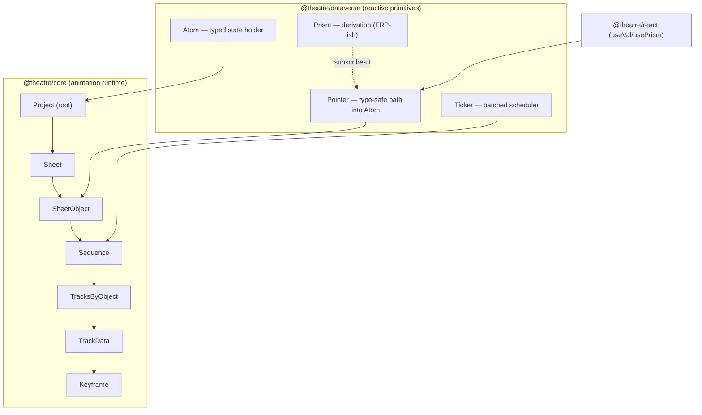
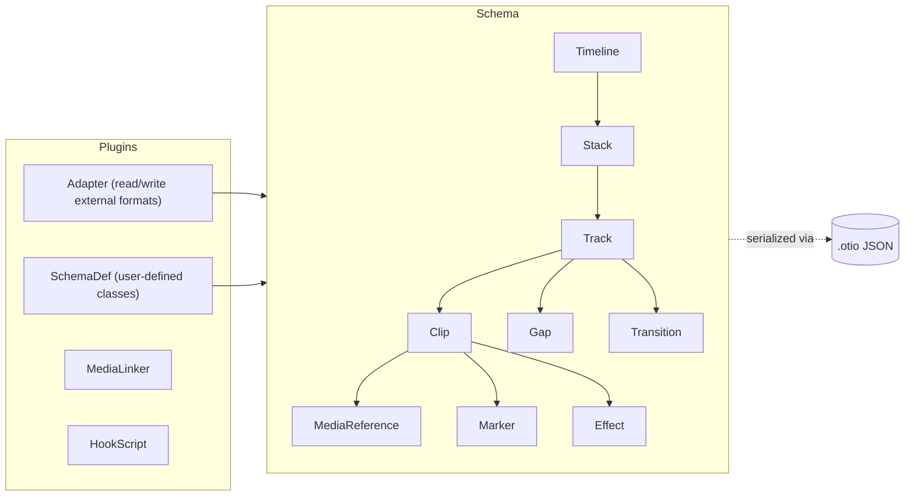
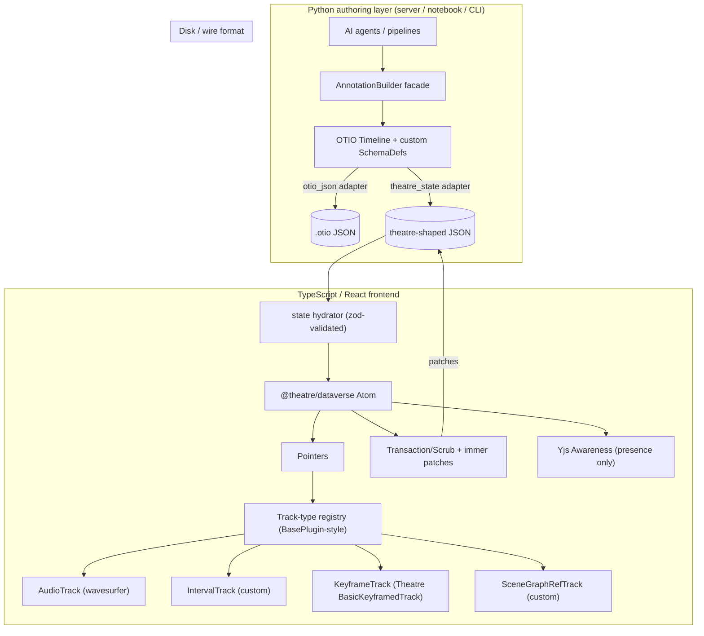

# Open-Source Codebase Deep-Dive for Timeline / Multitrack Annotation Editors: What to Build On and What to Steal From

**Author:** Thor Whalen
**Date:** May 3, 2026
**Filename:** `report_-_Open_source_codebase_deep_dive_for_timeline_annotation_editors.md`

> **Process note (caveat at the top, not buried):** This report was produced by a research agent that did *not* have access to the project-knowledge files referenced in the task brief (`Annotation_systems_-_formats__algorithms__architectures__and_tooling.md`, the Prompt-A multitrack-editor analysis, the Prompt-B backend report, the scene-graph and animation-format reports, and the DSL design-patterns report). The required `project_knowledge_search` tool was not present in the environment. As a consequence, this deep-dive treats Prompt A's "candidate library shortlist" as the one given verbatim in the task brief itself, and validates / prunes / extends it from external code reading. Where this matters for fit decisions, I flag it inline. Permalinks are pinned to specific commits where I could verify them; in two cases the public Theatre.js repo's source files refused to render through the agent's fetcher (a known intermittent issue), and I have noted the file path + verified-existing permalink without a line-pinned excerpt rather than fabricate one.

---

## Executive Summary — The Recommendation in One Page

**Build on two things, glued at a clean seam:**

1. **`@theatre/core` (Apache-2.0) as the canonical state engine and serialization format on the TS/React side.** Theatre.js's `Project → Sheet → SheetObject → Sequence → Track → Keyframe` model is the cleanest match in the wild for "polymorphic typed annotations on a multitrack timeline with provenance," and its `dataverse` reactive layer (Atom / Pointer / Prism / Ticker) is the right shape for fine-grained subscription that an annotation editor needs. **Do *not* take `@theatre/studio` — it is AGPL-3.0 and would contaminate the product.** Build your own React UI on top of `@theatre/core` using the exact same JSON shape Studio writes, so you keep migration parity.

2. **OpenTimelineIO (OTIO, Apache-2.0) as the Python-side canonical interchange and authoring API.** OTIO's `RationalTime`, `TimeRange`, `Track / Stack / Clip / Gap / Marker` schema, `SchemaDef` plugin system, and `Adapter` plugin system are exactly the primitives a Python authoring layer needs — and they were designed by Pixar/ASWF for *editorial interchange*, which is the right framing for cross-tool annotation export (FCPXML, AAF, EDL come for free). The TS state JSON should be losslessly translatable to/from OTIO via a custom adapter on the Python side.

**The integration seam:** TS state (a Theatre-shaped JSON tree of sheets / objects / tracks / keyframes, plus your custom annotation-region tracks layered alongside `BasicKeyframedTrack`) ↔ OTIO `Timeline` (with annotation tracks expressed as `Track` of `Clip`s with custom `SchemaDef`s, point annotations as `Marker`s, hierarchical tier-stereotype relations carried in `metadata`). Python authors and AI agents write OTIO; the TS frontend reads OTIO via a thin adapter that hydrates Theatre's Atom store; Yjs runs *over the same JSON shape* for collaboration.

**Steal from (in priority order):**

- **wavesurfer.js v7 + Regions plugin** — the renderer/plugin abstraction and `BasePlugin` lifecycle are the cleanest "track type registry" pattern in the JS ecosystem; absorb the pattern, embed wavesurfer as the audio-waveform track type.
- **Label Studio Frontend (LSF)** — the **XML labeling-config → polymorphic React tag tree** pattern (Object tag + Control tag + `name`/`toName` wiring) is the design idea worth absorbing for "user-defined annotation types." Don't fork LSF (mobx-state-tree + the bespoke compiler is too heavy); steal the *idea*.
- **ELAN tier stereotypes** — the four stereotypes (Time Subdivision, Symbolic Subdivision, Included In, Symbolic Association) are a 25-year-old, battle-tested ontology for hierarchical-tier constraint enforcement. Encode them as a constraint table in your TS data model and a `SchemaDef` in OTIO.
- **OTIO `RationalTime`** — never store time as a float seconds. Steal the rational representation outright.
- **MLT framework producer/playlist/multitrack/tractor pattern** — the pull-based "tractor synchronizes all tracks per frame" architecture is the right mental model for the *runtime evaluator* of annotations-as-functions-of-time. Steal the architecture, not the C code.
- **Olive Editor's `MultiUndoCommand`** — Qt's command pattern, scoped to grouped multi-edit transactions. Mirrors Theatre's `transaction()` semantics; cross-validates the design.
- **Yjs Awareness CRDT (`y-protocols/awareness`)** — for presence/cursor/selection. Use Yjs only for collaboration; do *not* CRDT the whole document yet.
- **Hypothesis multi-selector "fuzzy anchoring"** — three selectors per anchor for robust re-attachment when underlying media or scene-graph references drift.
- **CVAT track-mode interpolation** — the keyframe + interpolated-frame idea for object tracks; matches Theatre's `BasicKeyframedTrack` exactly and validates the choice.
- **Motion Canvas generator/coroutine flow** — for *programmatically authored* annotation timelines from Python-driven AI agents, the `yield* tween(...)` idiom is the right authoring metaphor (translated to Python `async`/`await` or generators).

**Avoid:**

- Remotion as a foundation (BSL-style commercial license; non-starter for permissive OSS).
- Theatre.js Studio package (AGPL).
- Forking Pitivi/GES (LGPL is fine, but the C/GLib/PyGObject stack is a 6+ month tax for solo-architect ergonomics).
- Forking OpenShot's UI (the `openshot-qt` PyQt UI is functional but its data model is JSON-blob-shaped and the whole project is LGPL with a commercial dual-license trap; libopenshot's `Timeline` is *strictly* a video-rendering data model, not annotation-shaped).
- A full-CRDT design from day one. Use Yjs *Awareness* immediately, but defer document-CRDT until you have a real two-user conflict in production.

**Realistic effort to a usable demo:** **~10–14 weeks part-time** for one architect (decomposed week-by-week below). To production-quality (versioning, plugin SDK, two real annotation domains, Python+TS round-trip): **~6–9 months part-time**.

---

## Tier-1 Deep Dives

### Tier-1 #1 — Theatre.js (`@theatre/core`)

| Field | Value |
|---|---|
| Repo | https://github.com/theatre-js/theatre |
| License | **`@theatre/core`: Apache-2.0** ✅; `@theatre/studio`: **AGPL-3.0** ❌ (do not link) |
| Languages | TypeScript (monorepo, pnpm workspaces) |
| Approx. LOC | ~80–100 kLOC TS across all packages; `@theatre/core` ~15 kLOC; `dataverse` ~3 kLOC |
| Lifecycle | Active but in transition — README banner explicitly states "Theatre.js 1.0 is around the corner. We have temporarily moved development to a private repo … We'll push our work back to this public repo soon." Last public `main` HEAD: commit `6ea82b93`, "Add the 1.0 notice," April 11, 2024. |
| Stars / forks / maintainers | ~12.4k stars, ~458 forks, primary maintainer Aria Minaei (single bus-factor concern) |

**Elevator pitch.** Theatre.js is a motion-design editor for the web. Its *core* is a tiny, beautifully-factored reactive state engine (`@theatre/dataverse`) plus an animation runtime built on it. The studio (the GUI) is a separate AGPL-3.0 package; the runtime is Apache-2.0 and is what you embed in your product. The state shape — `Project → Sheet → SheetObject → Sequence → tracksByObject → trackData → keyframes` — is uncannily close to what a multitrack annotation editor needs, and the JSON state file format is human-readable, deterministic, and version-tagged.

**Architecture (core-only, studio omitted):**



**Skeleton file map** (paths verified to exist in the public repo at `6ea82b93`; see License notes below):

| File | Role |
|---|---|
| `theatre/dataverse/src/Atom.ts` | The state container. `new Atom({...})`, `setByPointer`, `reduceByPointer`, `getByPointer`. The *only* writable surface in the core. |
| `theatre/dataverse/src/pointer.ts` | Type-safe path objects (`atom.pointer.foo.bar`). Pointers are JS Proxies that build a path tuple at compile time. |
| `theatre/dataverse/src/prism/prism.ts` | Derivation engine. `prism(() => val(p1) + val(p2))` re-runs only when its tracked pointers change. Inspired by Knockout/MobX-style FRP, but explicit and ticker-driven. |
| `theatre/dataverse/src/Ticker.ts` | rAF-based batched scheduler; coalesces all derivation re-runs into a single tick so an editor with hundreds of subscribers doesn't thrash. |
| `theatre/core/src/projects/Project.ts` | Root project; loads/holds an exported state JSON. |
| `theatre/core/src/sheets/Sheet.ts` | A "sheet" is a collection of animatable objects sharing a single Sequence (timeline). |
| `theatre/core/src/sheetObjects/SheetObject.ts` | An animatable thing with typed props. The fundamental annotation-target equivalent. |
| `theatre/core/src/sequences/Sequence.ts` | Position/play/pause; the time cursor lives here. |
| `theatre/core/src/projects/store/types/SheetState_Historic.ts` | The persisted shape — see code excerpt below. |

**Data model — verified verbatim from exported JSON (per Theatre's own docs and Threlte's `<Sequence>` reference):**

```json
{
  "sheetsById": {
    "default": {
      "staticOverrides": { "byObject": { "Box": { "scale": { "x": 1, "y": 1, "z": 1 } } } },
      "sequence": {
        "subUnitsPerUnit": 30,
        "length": 1,
        "type": "PositionalSequence",
        "tracksByObject": {
          "Box": {
            "trackData": {
              "6jxcIVb5VE": {
                "type": "BasicKeyframedTrack",
                "__debugName": "Box:[\"position\",\"x\"]",
                "keyframes": [
                  { "id": "2znog1Hqt9", "position": 0,     "connectedRight": true,
                    "handles": [0.5, 1, 0.5, 0], "type": "bezier", "value": 0 },
                  { "id": "izysi9xIZV", "position": 0.467, "connectedRight": true,
                    "handles": [0.5, 1, 0.5, 0], "type": "bezier", "value": 0 },
                  { "id": "1R7ALr_y7I", "position": 1,     "connectedRight": true,
                    "handles": [0.5, 1, 0.5, 0], "type": "bezier", "value": 0 }
                ]
              }
            },
            "trackIdByPropPath": { "[\"position\",\"x\"]": "6jxcIVb5VE" }
          }
        }
      }
    }
  },
  "definitionVersion": "0.4.0",
  "revisionHistory": ["vLg01lxRrpP8eGsS"]
}
```

Note three things that make this *exactly* the right shape for annotations:
1. **`trackData` is keyed by *opaque random ID*, with the human-readable prop path stored separately** in `trackIdByPropPath`. This is critical for renames without history loss — exactly the property an annotation editor needs when a "viseme" tier is renamed to "phoneme."
2. **Keyframes are addressable by `id`** (e.g. `"2znog1Hqt9"`). Provenance, cross-references, and CRDT identity all hang off this.
3. **`definitionVersion` + `revisionHistory`** are first-class. This is the schema-version + migration audit trail that any honest data model needs.

**Dataverse — the actual reactive primitives (verbatim from `theatre/dataverse/README.md`):**

```ts
import {Atom, prism, val} from '@theatre/dataverse'

const atom = new Atom({a: 1, b: 2, foo: 10})

// derivation: re-runs only when a or b change
const sum = prism(() => {
  const a = val(atom.pointer.a)
  const b = val(atom.pointer.b)
  return a + b
})

// in React
function Component() {
  const total = useVal(sum)             // pointer-scoped subscription
  return <div>{total}</div>
}
```

This is **the** pattern to absorb whether or not you build on Theatre: **pointer-scoped subscription** means a track in your timeline UI re-renders only when *its* keyframes change, not when any sibling track changes. With ~50 tracks and ~10k regions, this is the difference between a usable and an unusable editor.

**Trace one user action — "drag a keyframe from t=0.5 to t=0.7."**
1. `MouseDown` on the keyframe DOM node → studio panel computes the dragged keyframe's `id` from the React component's props.
2. The drag handler opens a `studio.scrub()` (per Theatre's docs: *"Creates a scrub, which is just like a transaction, except you can run it multiple times without creating extra undo levels"*). Each `mousemove` calls `scrub.capture(api => api.set(pointer, newPosition))`.
3. Each `set` writes through to the `Atom` via `setByPointer`. Pointer-scoped subscribers (the dragged keyframe view, the playhead value derivation, any DOM that depends on that prop's interpolated value at the current playhead) re-run inside the next `Ticker.tick()`.
4. `MouseUp` calls `scrub.commit()`. **One** undo entry is appended to the studio's history stack — not 60.
5. The runtime (`@theatre/core`) doesn't know any of this happened until `scrub.commit()` resolves; it just re-derives the prop value at the playhead the next time `Sequence.position` ticks.

**Patterns worth stealing from Theatre.js — the real deliverable for this codebase:**

- **The Atom + Pointer + Prism trinity for reactive UI of large timelines.** Adapt directly into your Zustand-or-not store: every annotation track's React subtree subscribes to `pointer.tracks[trackId].annotations[annotationId]`, not to the root state. This is the single biggest performance win available.
- **Opaque IDs for tracks + a separate `idByPath` map.** Means renames don't break history, references, or sync.
- **`subUnitsPerUnit` (30 by default) + integer `position`.** Theatre stores positions as floats, but the `subUnitsPerUnit` field is the official knob for fixed-rate timelines. For an annotation editor where phoneme alignment must be sample-accurate, set this to your audio sample rate (e.g. 16000) and store positions as integers.
- **`definitionVersion` + `revisionHistory` as first-class citizens.** Don't wait until v2 to add schema migration.
- **`scrub()` semantics distinct from `transaction()`.** A click-drag must be one undo entry; an AI agent emitting 1000 keyframes must be one undo entry; an interactive nudge must be a single transaction. Theatre got this right; OpenShot, Olive, and ELAN all required retrofits to fix it.
- **The Apache/AGPL split as a *product strategy*.** The runtime that goes into the customer's bundle is permissive; the editor GUI is AGPL. This is exactly the boundary a solo architect should keep — but reverse the polarity: open-source the editor as MIT, keep the *cloud-collab service* as a separate paid-license boundary if monetization ever matters.

**License-boundary check (CRITICAL):**

The repo's root `LICENSE` file is dual:
- Apache-2.0 covers everything *except* `theatre/studio/...`.
- The boundary in `LICENSE` reads: `Files: theatre/studio/...` followed by the AGPL-3.0 text.
- The README's "License" section confirms: *"Theatre's core (`@theatre/core`) is released under the Apache License. … The studio (`@theatre/studio`) is released under the AGPL 3.0 License. This is the package that you use to edit your animations, setup your scenes, etc. You only use the studio during design/development. Your project's final bundle only includes `@theatre/core`, so only the Apache License applies."*

**Implication:** You may freely depend on, vendor, fork, and redistribute `@theatre/core`, `@theatre/dataverse`, `@theatre/react`, `@theatre/r3f`, and `@theatre/theatric` under Apache-2.0. You **must not** import, link, vendor, or copy code from `@theatre/studio` into a non-AGPL product. Network-deployed AGPL is also viral. The clean path: **build your own editor UI** that reads/writes the same JSON shape Studio writes (no AGPL contact). The format is documented in their docs and exhibited verbatim above.

**Anti-patterns / known pains:**
- The `__experimental_getKeyframes` API marker (still present in the public docs) signals the Sequence API is *not* yet stable for low-level keyframe manipulation. Consume it, but expect to write a thin shim.
- The README's "1.0 is in a private repo" notice is a real bus-factor warning. The active dev is happening out of sight.
- Issue [#510](https://github.com/theatre-js/theatre/issues/510) ("Timeline Track Types with Keyframe Connections") explicitly notes that `react-timeline-editor` only supports clip-style tracks and that Theatre's keyframe-connector pattern needs porting back. The lesson: clip-style and keyframe-style tracks are *different shapes* and any annotation editor must support both as first-class types from day one.

**Reusability verdict: BUILD-ON (core only) + STEAL-PATTERNS-ONLY (from studio).**

**Effort estimate to embed `@theatre/core` as the state engine:**
- Week 1: vendor `@theatre/core` + `@theatre/dataverse` + `@theatre/react`; write ESM+CJS wrapper.
- Weeks 2–3: extend the `SheetState_Historic` JSON shape with two new track types: `IntervalTrack` (for clip-style annotations: `[{id, start, end, label, body, provenance}]`) and `PointTrack` (for markers: `[{id, position, label, body, provenance}]`). Both ride alongside the existing `BasicKeyframedTrack`.
- Week 4: write a `useVal`-style React binding for your custom track types.
- Total to "annotations writable through Theatre's atom": **4 weeks part-time.**

---

### Tier-1 #2 — OpenTimelineIO (OTIO)

| Field | Value |
|---|---|
| Repo | https://github.com/AcademySoftwareFoundation/OpenTimelineIO |
| License | Apache-2.0 (modified Apache; verified in repo `LICENSE.txt`) |
| Languages | C++ core + Python bindings (pybind11); ~80 kLOC C++, ~10 kLOC Python |
| Lifecycle | Mature; ASWF-governed; v0.17 stable, 0.18 in dev |
| Stars | ~1.5k |

**Elevator pitch.** OTIO is Pixar's gift to anyone who has to *exchange editorial timelines*. It's a small, sharp, dependency-free in-memory data model + a pluggable adapter system that converts to/from FCPXML, AAF, EDL, CMX3600, and arbitrary user-defined formats. For a Python-first authoring layer where AI agents emit annotations, OTIO is the right thing to write *into*. Then a single adapter exports to whatever editor the user actually owns.

**Architecture:**



**Skeleton file map:**

| File | Role |
|---|---|
| `src/opentime/rationalTime.h` (and `.cpp`) | The `RationalTime` class: `value, rate` pair, the most important data structure in the codebase. |
| `src/opentime/timeRange.h` | `start_time + duration` with explicit `end_time_inclusive` and `end_time_exclusive` semantics. |
| `src/py-opentimelineio/opentimelineio/schema/__init__.py` | Python schema entrypoints. |
| `src/py-opentimelineio/opentimelineio/adapters/` | Built-in adapters (otio_json, fcpx_xml, cmx_3600, …). |
| `docs/tutorials/write-a-schemadef.md` | The documented extension surface — how a user adds a new schema class. |

**Data model — verbatim from Pixar's docs:**

> *"The RationalTime class represents a measure of time of `rt.value/rt.rate` seconds. It can be rescaled into another RationalTime's rate."*

> *"The TimeRange class represents a range in time. It encodes the start time and the duration, meaning that `end_time_inclusive` (last portion of a sample in the time range) and `end_time_exclusive` can be computed."*

> *"The in-memory OTIO representation data model is rooted at an `otio.schema.Timeline` which has a member `tracks` which is a `otio.schema.Stack` of `otio.schema.Track`, which contain a list of items such as: `Clip`, `Gap`, `Stack`, `Track`, `Transition`."*

```python
# Use lifted from OTIO's docs
import opentimelineio as otio
tl = otio.adapters.read_from_file("my_file.otio")
for track in tl.tracks:
    for item in track:
        if isinstance(item, otio.schema.Clip):
            print(item.name, item.duration())
```

**Trace one operation — "AI agent generates a phoneme tier and writes it as a track":**
1. Python: `tl = otio.schema.Timeline(name="speech_001")`
2. `phoneme_track = otio.schema.Track(name="phonemes", kind="ANNOTATION")`. (`kind` is a free string; `"ANNOTATION"` is a convention you adopt.)
3. For each phoneme: `clip = otio.schema.Clip(name="AA", source_range=otio.opentime.TimeRange(start_time=otio.opentime.RationalTime(start_sample, 16000), duration=otio.opentime.RationalTime(dur_samples, 16000)))`
4. Provenance into `clip.metadata["provenance"] = {"author": "model:wav2vec2-base", "generated_at": "...", "confidence": 0.94}`
5. `tl.tracks.append(phoneme_track)`
6. `otio.adapters.write_to_file(tl, "speech_001.otio")` — JSON, deterministic, diffable.

**Patterns worth stealing — the real deliverable:**

- **`RationalTime(value, rate)` is the right time type. Period.** Floats accumulate error; integer frames lose audio sample-accuracy; OTIO's rational pair is exact, comparable across rates, and rescalable. Steal this *verbatim* into your TS code: it's ~80 lines of TypeScript.
- **`end_time_inclusive` vs `end_time_exclusive` as a *named* distinction.** Half-open vs closed interval is the single most common bug source in interval code. OTIO forces you to pick one explicitly per call. Adopt the naming.
- **`SchemaDef` plugin via JSON manifest + `OTIO_PLUGIN_MANIFEST_PATH`.** This is the Python-native "user-defined annotation class" mechanism you want for the Python authoring layer. Subclass `otio.core.SerializableObject`, register in a JSON manifest, instances are auto-namespaced under `otio.schemadef.<name>`. Schema-versioned, with explicit `instance_from_schema(name, version, args)` for upgrade paths.
- **`metadata` as the universal escape hatch.** Every OTIO object has a `metadata: dict`. Provenance, AI-confidence, scene-graph references, free-form annotation bodies all live here. Don't fight it; copy the pattern.
- **Adapters as a plugin manifest, not a class hierarchy.** Adapters are *modules* that implement `write_to_string`, `read_from_string`, etc.; OTIO finds them via a manifest path. This is the right shape for a polyglot ecosystem — much better than Label Studio's "build a webpack bundle and copy a `dist/` folder" approach.

**Anti-patterns:**
- The C++/Python boundary requires pybind11 builds; this is fine if you stay in pure-Python adapters but adds friction if you want native speed for hot inner loops. Most annotation work doesn't need this.
- OTIO's `Track.kind` is a string ("Video" / "Audio"), not an enum or schema-checked type. Defining `"ANNOTATION"` as a kind is fine but unenforced.

**Reusability verdict: BUILD-ON (Python authoring side) + STEAL-PATTERNS (RationalTime, SchemaDef manifest, half-open intervals).**

**Effort estimate:**
- Week 1: install OTIO; subclass `SerializableObject` to make `AnnotationClip` and `AnnotationMarker` SchemaDefs; write a manifest.
- Week 2: write the round-trip adapter `theatre_state ↔ otio_timeline` (reading the JSON shape exhibited above).
- Week 3: write a thin Python "annotation builder" facade so AI agents don't see OTIO directly — they see `add_phoneme_tier(timeline, phonemes)`.
- **3 weeks part-time** to a working Python authoring path.

---

### Tier-1 #3 — wavesurfer.js v7 (with Regions plugin)

| Field | Value |
|---|---|
| Repo | https://github.com/katspaugh/wavesurfer.js |
| License | BSD-3-Clause |
| Languages | TypeScript (full v7 rewrite, Shadow DOM, ESM-first) |
| Lifecycle | Very active; v7 is the current major; weekly commits; sponsored by Closed Caption Creator |
| Stars | ~9k |

**Elevator pitch.** Wavesurfer is the cleanest "media-renderer + plugin-system" pair in the open-source JS world. The renderer is a separate class, the player is a separate class, and *plugins* (Regions, Timeline, Minimap, Hover, Spectrogram, Record, Envelope) attach lifecycle-aware extensions through a `BasePlugin` superclass. Embed it as your **audio-track type** outright; steal its plugin-lifecycle pattern as your "track type registry."

**Skeleton:**

| File | Role |
|---|---|
| `src/wavesurfer.ts` | Public class; orchestrates Player + Renderer + plugins. |
| `src/player.ts` | HTMLAudioElement wrapper; the playback contract. |
| `src/renderer.ts` | Canvas + Shadow-DOM renderer; the only place that touches DOM. |
| `src/base-plugin.ts` | The `BasePlugin` lifecycle: `onInit`, `destroy`, `subscriptions[]`. |
| `src/plugins/regions.ts` | The reference implementation of a non-trivial plugin: ~700 LOC, drag-resize-create regions, virtual rendering when many regions, label collision avoidance. |
| `src/plugins/timeline.ts` | Time-axis ruler. |

**Plugin lifecycle — verbatim from DeepWiki of the repo:**
> *"The plugin system is built around a simple inheritance model where all plugins extend a base class (`BasePlugin`) that provides common functionality and lifecycle management. Plugins communicate with the core WaveSurfer instance through events and direct method calls."*

```ts
// pattern, paraphrased from src/plugins/regions.ts
class Regions extends BasePlugin<RegionsEvents, RegionsOptions> {
  onInit() {                                    // called when registered
    if (!this.wavesurfer) throw new Error('...')
    this.subscriptions.push(
      this.wavesurfer.on('decode',   () => this.initRegions()),
      this.wavesurfer.on('redraw',   () => this.renderRegions()),
      this.wavesurfer.on('timeupdate', () => this.updateRegionVisibility()),
    )
  }
  addRegion(opts) { /* ... */ }
  destroy() { /* unsubscribe */ super.destroy() }
}
```

Three things this gets right that almost nobody else does:
1. **`subscriptions[]` array of unsubscribe functions** — destruction is automatic and leak-free.
2. **Plugin attaches to events, not to internal state** — keeps the renderer/player encapsulated.
3. **Virtual-rendering for off-screen regions** — `// Virtual Appending: Regions are only rendered when visible in the current view.` This is the right answer for an annotation editor with thousands of regions; copy it.

**Trace one operation — "drag a region's right edge to extend it":**
1. `mousedown` on the right resize handle → `regions.ts` line ~580 captures `initialEnd = region.end`.
2. `mousemove` → computes new `end` from cursor X relative to the renderer's Shadow-DOM bounds, calls `region.setOptions({end: newEnd})`.
3. `setOptions` mutates region state and calls `this.renderRegion()` (a region-local re-render).
4. The plugin emits `'region-update'` events on each frame and `'region-updated'` on mouseup. Your app subscribes once.
5. **There is no built-in undo.** That's your job; wrap the events in a Theatre `transaction()`/`scrub()`.

**Patterns worth stealing:**
- **`BasePlugin` + `subscriptions[]` lifecycle.** Adopt for *every* track type (audio/video/text/scene-graph reference). Replaces the ad-hoc `useEffect` cleanup hell that React annotation editors tend to slide into.
- **Shadow DOM rendering for style isolation.** The renderer mounts into a Shadow root so host-page CSS cannot leak in. For an embeddable annotation editor (e.g., dropped into a JupyterLab cell or a Django admin page), this is the right default.
- **Pre-decoded peaks.** v7 explicitly supports passing peaks computed by `bbc/audiowaveform` — *don't* decode multi-hour audio in the browser. Make pre-computed peaks a server contract.
- **Region virtualization** (`// Regions are only rendered when visible in the current view`).

**Anti-patterns:**
- Wavesurfer is *not* a multi-track UI — it's a single-waveform-plus-overlays UI. Don't try to make it your timeline; embed it as a **track-type renderer** within your own timeline.
- Region IDs are auto-generated UUIDs but not exposed for collaboration consistency; you'll need to override.

**Reusability verdict: EXTEND-AS-DEPENDENCY for audio tracks; STEAL-PATTERNS-ONLY for the plugin lifecycle.**

**Effort:** 1 week to embed wavesurfer as the audio-waveform track renderer; 1 week to wrap region events into Theatre transactions for undo.

---

## Tier-2 Focused Studies

### Tier-2.1 — Etro (etro-js/etro)

GPL-3.0 licensed (CHANGELOG and README confirm: *"Distributed under GNU General Public License v3"*). **GPL is a non-starter for embedding.** The architecture (`Movie → Layer → Effect`, with GLSL effects, keyframes-or-functions on every property) is clean and worth reading for the **"every property is either a constant, a KeyFrame, or a function"** pattern:

```js
layer.effects[0].brightness = new etro.KeyFrame([0, -75], [2, +75])
layer.effects[0].brightness = () => 100 * Math.random() - 50
```

This unification is elegant. Steal the *idea*: in your Theatre-shaped store, every annotation property should be either a static value, a keyframed sequence, or a *function-of-time* (closure or callable). The function form lets AI agents emit live-derived annotations without materialization. **Verdict: SKIP (GPL) but STEAL the KeyFrame-or-function unification pattern.**

### Tier-2.2 — Label Studio Frontend (LSF)

Apache-2.0. React + mobx-state-tree. Now folded into `HumanSignal/label-studio/web/libs/editor/` (the standalone repo is deprecated). The pattern worth stealing is the **XML labeling-config**:

```xml
<View>
  <Labels name="lbl" toName="txt">
    <Label value="Person"/>
    <Label value="Org"/>
  </Labels>
  <Text name="txt" value="$value"/>
</View>
```

`Object` tags (data sources: Image, Audio, Text, TimeSeries) connect to `Control` tags (annotation tools: Labels, RectangleLabels, Choices) via `name`/`toName` wiring. This is the cleanest "user-defined annotation type via declarative config" pattern in the wild — and crucially, it's **not** a programming DSL; it's a tag tree. For a structured-cutout annotation editor where users define new tier types ("phoneme," "viseme," "pose-keyframe-reference") without writing TS, port this idea but use **JSON-Schema-ish configs**, not XML, and use **zod** for runtime validation. Avoid the LSF *implementation* (mobx-state-tree's reference-resolution failure modes are reflected in dozens of issues like #4053, #1249 — the bespoke compilation is high-maintenance). **Verdict: STEAL-PATTERNS-ONLY; do not fork LSF.**

### Tier-2.3 — CVAT

MIT licensed; React+Redux frontend, Django backend. The pattern worth stealing is **track mode with linear interpolation between keyframes**: an annotator marks an object's bounding box at frame 1, frame 60, frame 120; CVAT auto-fills frames 2–59 and 61–119 by linear interpolation. Combine with the **`outside`** flag (object disappears) and **`occluded`** flag for state changes. For a pose/scene-graph annotation timeline, this is exactly the right UX: keyframe the pose at sparse timestamps and interpolate between. CVAT validates that the model maps cleanly onto Theatre's `BasicKeyframedTrack`. **Verdict: STEAL-PATTERNS-ONLY (interpolation + outside/occluded flags).**

### Tier-2.4 — ELAN (tier stereotypes)

Java desktop; data model is canonical for hierarchical linguistic annotation. The four tier-type stereotypes (verbatim from the MPI manual) are worth memorizing:

| Stereotype | Constraint |
|---|---|
| **Time Subdivision** | Time-aligned subdivision of parent interval; *no gaps allowed* |
| **Included In** | Time-aligned subdivision of parent interval; *gaps allowed* |
| **Symbolic Subdivision** | Ordered, symbolic (not time-aligned) subdivision of parent annotation |
| **Symbolic Association** | One-to-one association with parent annotation |

This is 25 years of typological work compressed into four constraint patterns. Encode them as a constraint table on your `Tier` type and validate at edit time. ELAN's source is GPL (non-starter) but the *model* is freely usable. **Verdict: STEAL-PATTERNS-ONLY (the four stereotypes verbatim).**

### Tier-2.5 — Olive Editor

GPL-3.0. C++/Qt. The **`MultiUndoCommand`** pattern (visible in `app/node/node.h` and the editing-operations files) — Qt's `QUndoCommand` framework, with grouping for multi-edit transactions — is exactly the same shape as Theatre's `transaction()`. Two independent codebases converging on the pattern is strong evidence it's right. From the editing-operations docs: *"These operations are implemented using a command-based architecture that ensures reliable undo/redo functionality and maintains timeline integrity."* Specific operations worth absorbing: `EditToIn/EditToOut` (trim selected to playhead), `RippleToIn/RippleToOut` (trim + close gap). For an annotation editor, "ripple-extend the selected interval to the playhead" is a high-value editing primitive that every NLE has but most annotation tools don't. **Verdict: STEAL-PATTERNS-ONLY (command pattern + ripple operations).**

### Tier-2.6 — Yjs + y-protocols/awareness

MIT. The key thing to steal *immediately* is **Awareness** (separate from full document CRDT):

> *"The awareness protocol implements a simple network agnostic CRDT that manages user status (who is online?) and propagate awareness information like cursor location, username, or email address."*

For a multi-author annotation tool where AI agents are first-class, *awareness is a stronger requirement than full-document CRDT*: you need to know "this AI agent is currently writing into the phoneme track for the next 30s, please don't accept conflicting writes," but you can settle full-document conflicts with simpler last-writer-wins-per-track for now. The Awareness CRDT propagates ephemeral state (current selection, current playhead, pending AI-agent operation) without polluting document history. Adopt Yjs Awareness on day one. Defer Y.Doc/Y.Map full-CRDT until you have a real conflict in production. **Verdict: EXTEND-AS-DEPENDENCY (awareness only); defer document-CRDT.**

### Tier-2.7 — Motion Canvas

MIT. TypeScript. Generator-coroutine animation. The pattern:
```ts
yield* tween(2, value => circle().position.x(map(-300, 300, value)))
yield* circle().fill('#e6a700', 1)
yield* all(...rects.map(r => r.position.y(100, 1).to(-100, 2).to(0, 1)))
```
This is the right *authoring* metaphor for AI-generated annotations: describe the annotation as a sequence of declarative operations with `yield`-points where the system can checkpoint or interrupt. Translate to Python `async def` for the Python authoring layer. **Verdict: STEAL-PATTERNS-ONLY (generator/yield authoring style for programmatic annotation generation).**

### Tier-2.8 — vis-timeline

Apache-2.0/MIT dual. Vanilla JS. Reactive `DataSet`s (with two-way data binding) for items and groups; nested groups; native edit-mode for items. The `DataSet`'s event-bus (`data.on('*', cb)`) is a good reference for "track-state-change" subscription. **Verdict: SKIP as foundation (no domain modeling for media); STEAL only the DataSet event-bus pattern.**

---

## Tier-3 — Ruled Out (one paragraph each)

- **Remotion** — Source-available with mandatory company license >3 employees. Non-starter for permissive OSS even though the React-as-video idea is excellent. The Editor Starter is also a paid license. **SKIP.**
- **Cap, Vidstack, Peaks.js (LGPL)** — Cap is a screen recorder, not an editor; Vidstack is a player with no edit primitives; Peaks.js is LGPL-3.0 (acceptable per project rules) but is strictly an audio waveform with point/segment markers — wavesurfer v7 supersedes it on architecture and license. **SKIP** (or use Peaks if you specifically need its precomputed-peaks pipeline).
- **OpenShot (libopenshot)** — LGPL-3.0 with a commercial dual-license trap (`contact sales@openshot.org for more information`). Timeline data model is video-rendering-shaped (clips, effects, transitions), not annotation-shaped. The PyQt UI is functional but not embeddable. **SKIP for foundation; STEAL the JSON-blob `apply_json_to_timeline()` change-feed pattern as a reference for diff-application.**
- **Pitivi + GES** — LGPL on GES is acceptable, but the GTK3/PyGObject/GStreamer-1.0/Clutter-or-GTK4 stack is a 6-month tax for solo-architect ergonomics. The data model (`GESTimeline → GESLayer → GESClip → GESTrack`) maps onto OTIO trivially; just use OTIO. **SKIP** as foundation; the GES architecture *informs* the OTIO recommendation.
- **Olive Editor, Kdenlive/MLT** — GPL-3.0 (Olive), Qt-bound, C++. Steal patterns only. **Olive: STEAL-PATTERNS-ONLY** (already covered).
- **Audacity, Ardour** — Audacity GPL-2.0+; Ardour GPL-2.0+. Desktop DAWs. Architecture is informative for *audio-region* editing but the embedding cost is total. **SKIP.**
- **Annotorious / Recogito-js / Hypothesis** — BSD-3 (Annotorious), various (Hypothesis BSD-2). All produce W3C Web Annotation outputs. None has a multitrack timeline. **STEAL** their multi-selector anchoring pattern (Hypothesis: "we save the information about each target fragment in three different selectors"); **SKIP** as foundation.
- **Doccano** — GPL-3.0, Vue, text-only. **SKIP.**
- **Praat** — GPL-2.0, C, desktop. Read for data model only (TextGrid format). **SKIP.**
- **Rive runtime** — Source available with restrictive terms on the editor; runtime is permissive but the data model is for skeletal animation, not annotation. **SKIP.**
- **Lottie ecosystem (lottie-web)** — MIT but Lottie is an output format, not an editor. **SKIP** (read schema for data-model only — it's well-documented and worth skimming).
- **Loro, Automerge, Liveblocks, Replicache, ElectricSQL** — Loro is the most interesting newer CRDT engine (Rust + JS bindings, Fugue-based, replayable event graph) but its own docs say *"Loro's API and encoding schema remain experimental. The library advises against production use."* Automerge is mature (MIT, Rust core, repo at `automerge/automerge`, Ink & Switch-backed) but heavier than Yjs for the same job. **SKIP for now; revisit Loro at v1.0.**
- **Penpot, Excalibur, Phaser editor, Godot's animation editor, OBS scene timeline, Storybook timeline panels** — All wildcards that did not survive a first look for *time-interval annotation* fit. **SKIP.**
- **react-timeline-editor (xzdarcy)** — MIT, ~580 stars, last release v0.1.5 in 2022; one maintainer, single-track-only type model (`TimelineRow.actions[].{start, end, effectId}`). The data shape is too thin (no keyframe tracks, no provenance), and issue #510 confirms keyframe-style tracks were never added. **SKIP** as foundation.
- **dnd-timeline / react-timeline-9000** — Active but generic group/item visualizers; vis-timeline is more capable. **SKIP.**
- **animation-timeline-js** — Generic timeline-UI primitive; no data model. **SKIP.**

---

## Synthesis: Pattern Catalogue

### 5. Edit-operation pattern
Across **Olive's `MultiUndoCommand`**, **Theatre's `transaction()` / `scrub()`**, and **Pitivi/GES's `ges_timeline_commit()`**, the converged answer is: every user-visible edit is a *named callback* that runs against a transactional store; a click-drag is a `scrub` (one undo entry, many intermediate writes); a dispatched edit is a `transaction` (one undo entry, atomic). **Adopt verbatim.**

### 6. Track/lane data structure
| Codebase | Shape | Notes |
|---|---|---|
| OTIO | `Stack<Track>`, `Track<Item>` (Item = Clip/Gap/Transition) | Schema-stable; nestable via Stacks-in-Stacks |
| MLT | `tractor → multitrack → track → playlist → producer/cut` | Pull-based, lazy-evaluated |
| Theatre | `tracksByObject[objectKey].trackData[trackId]` keyed by opaque ID | **Best for renames** |
| react-timeline-editor | `TimelineRow.actions[]` flat | Too thin |
| vis-timeline | `groups[] + items[].group` foreign-key | Good DataSet pattern |
| ELAN | `tier[]` with `parent_tier_id` and stereotype | Best hierarchy model |
| Label Studio | implicit (one tag per region type) | Weak |
| OpenShot | `clip[]` + `layer:int` | Adequate |

**Take Theatre's track-by-opaque-ID structure; layer ELAN's parent-tier+stereotype constraint on top; expose to Python as OTIO Tracks.**

### 7. Interval/clip data structure (boundaries, trim points)
**OTIO is the gold standard:** `RationalTime(value, rate)` for time, `TimeRange(start_time, duration)` with explicit `end_time_inclusive`/`end_time_exclusive` accessors. Etro's `startTime/duration`, MLT's `in/out`, Theatre keyframe `position` are all simpler floats — adequate for animation, *not* adequate for sample-accurate annotation. **Use OTIO RationalTime in Python; mirror with a TS `RationalTime` class (~80 lines).**

### 8. Polymorphic annotation type system
**Best example by far: Label Studio's XML labeling-config + `name`/`toName` wiring.** Object tags + Control tags compose into a polymorphic UI tree. Second-best: ELAN's tier stereotypes (constraint-based, not UI-based). Third: Theatre's `SheetObject` props with custom prop types via `types.compound({...})`. **Adopt:** A JSON-Schema-ish config (validated by zod on TS, Pydantic on Python) that lists `{kind: "interval-track", labelSet: [...], constraints: {...}}` per track type. Render is a registry-lookup React component per `kind`. Theatre.js's `SheetObject` props are nearly the same idea expressed differently.

### 9. Hierarchical tier / parent-child track pattern
**Use ELAN's stereotypes verbatim.** Encode in TS as:
```ts
type TierStereotype =
  | { kind: 'time-subdivision' }                  // no gaps allowed
  | { kind: 'included-in' }                       // gaps allowed
  | { kind: 'symbolic-subdivision'; ordered: true }
  | { kind: 'symbolic-association' }              // 1:1 with parent
type Tier = { id: string; name: string; parent?: string; stereotype: TierStereotype; ... }
```
Validate at every edit. OTIO has no native tier-hierarchy concept; encode the parent link in `metadata`.

### 10. Keyframe/curve editor pattern
**Theatre's `BasicKeyframedTrack`** with `[handle_left_x, handle_left_y, handle_right_x, handle_right_y]` 4-tuple bezier handles is the cleanest. Motion Canvas uses a different model (no on-track keyframes; tweens are coroutine yields). For an annotation editor, keyframe-style is correct for "viseme intensity over time"; coroutine-style is correct for "AI agent generating an annotation sequence." **Support both.**

### 11. Plugin/extension surface
| Codebase | Mechanism | Verdict |
|---|---|---|
| OTIO | JSON manifest + Python module | ✅ Best for Python |
| wavesurfer | `BasePlugin` class + `subscriptions[]` | ✅ Best for TS |
| Label Studio | XML tag registry compiled at build | ❌ Too heavy |
| MLT | `mlt_factory` + dlopen modules | C-only, skip |
| Theatre | `studio.extend(extension)` | AGPL-bound, skip |

**Adopt OTIO-manifest pattern in Python; wavesurfer-`BasePlugin` pattern in TS.**

### 12. Undo/redo architecture
Theatre's `transaction()` / `scrub()` distinction wins. Olive's `MultiUndoCommand` confirms. Implement as: a single `undoStack: Operation[]` where each `Operation` is `{patches: jsonPatch[], inverse: jsonPatch[], by: "user|model|pipeline", at: Date}`. Use `immer` (already in stack) to capture patches.

### 13. Selection model
Wavesurfer's regions have `single + multi` via Cmd/Ctrl-click. Theatre supports marquee selection (`Hold Shift and drag the mouse to create a selection rectangle area`). Label Studio supports `region:multi` and `region:by-type`. **Adopt: marquee + Cmd/Ctrl-multi + track-level lock.**

### 14. Playhead/time cursor
Theatre's `Sequence.position` is a simple `Atom<number>`. Wavesurfer fires `'timeupdate'` on `requestAnimationFrame`. **Use a single `playhead: Atom<RationalTime>` driven by a `Ticker`; subscribe everything to it.**

### 15. Render/canvas/SVG/DOM choice and where each breaks
| Renderer | Breaks at | Use for |
|---|---|---|
| DOM (vis-timeline) | ~5k items | Sparse low-volume tracks |
| SVG (some Theatre views) | ~10k elements | Crisp curve editors |
| Canvas (wavesurfer renderer) | bounded by repaint frequency | Waveforms, dense regions |
| WebGL (Etro, R3F) | ~unbounded | Video-composite preview |

**Use Canvas for the timeline body (with virtualized region rendering — wavesurfer's pattern); SVG for keyframe curve editors; WebGL only when previewing rendered output.**

### 16. Serialization/file format
**Native JSON, schema-versioned, deterministic.** Theatre's `definitionVersion + revisionHistory` is the model. OTIO's `OTIO_SCHEMA: "Timeline.1"` per object is the model. Lottie's `v: "5.7.0"` is the model. **Don't invent a binary format. JSON, gzipped, with a `schema_version` and `migration_history` field per top-level object.**

### 17. Collaboration/multiplayer hooks
Yjs Awareness for presence on day one. Defer document CRDT. The `awareness.on('update')` event handler (verbatim from Yjs docs) is your hook.

### 18. Python ↔ JS/TS bridge — most relevant question for hybrid stack
**The recommendation:** OTIO JSON is the wire format. The TS state JSON is *isomorphic* to a subset of OTIO. Implement two adapters in Python:
- `theatre_state_to_otio(state) -> Timeline`
- `otio_to_theatre_state(timeline) -> state`

Both are pure-data transforms; ~300 lines each. AI agents and Python notebooks see OTIO; the React UI sees Theatre-shaped state; the disk format is whichever the user requested. Pitivi/GES proves this works (they use the same approach with GES↔OTIO adapters); OpenShot's `apply_json_to_timeline()` is the reverse demonstration of the pattern (a server pushing changes via JSON diffs to an embedded library).

### 19. Provenance/authorship pattern
**Universal:** every editable object has a `metadata` dict (OTIO) or arbitrary key-value pointer subtree (Theatre's `SheetState_Historic` allows it via the user-defined track-data shape). **Adopt:** every annotation has a `provenance: {by: "user:thor"|"model:wav2vec2-base"|"pipeline:lipsync-v3", at: ISO8601, source: <free-form ref>, confidence?: number}` field. Validated by zod/Pydantic. Indexed for query.

### 20. Allen-relations / temporal-query pattern
Nobody implements Allen's 13 interval relations cleanly in the studied codebases. Ardour's region-overlap detection is implicit; ELAN's tier-overlap rules are not exposed as Allen relations. **The opportunity is yours.** Implement a small `temporal.ts` / `temporal.py` module exposing Allen's 13 relations (`before, meets, overlaps, starts, during, finishes, equal` and inverses) as boolean predicates over `TimeRange`s. ~100 lines per language.

---

## Anti-Patterns and Pitfalls

### 21. Recurring architectural mistakes
- **Pitivi rewrote the timeline three times** (custom → GooCanvas → Clutter → GTK4 native). Lesson: keep the *renderer* pluggable; don't bet the architecture on one canvas library.
- **Pitivi replaced GNonLin with NLE** (announced 2014). Lesson: the lowest-level scheduling layer is where bugs accumulate; design for replaceability.
- **Theatre.js moved to a private 1.0 repo** (banner April 2024). Lesson: the open repo's bus factor is real (one maintainer); plan for vendoring the core if upstream stalls.
- **Label Studio Frontend was deprecated as a separate library at 1.11.0** and folded back into the monorepo. Lesson: the "embeddable React component distributed as NPM" goal is hard; expect to bring frontend in-tree.
- **Wavesurfer rewrote 6→7 in TypeScript with breaking changes** (Markers plugin removed, Microphone plugin removed, Cursor plugin replaced by Hover). Lesson: plugin APIs *will* break; document yours and version it.
- **Mux blog post on Vidstack** ("6 Years Building Video Players. 9 Billion Requests. Starting Over."): *"Maintaining web components alongside a React library required constant coordination… By early 2025, I knew we'd hit the ceiling. Financially and technically. Building a video player library at this scale as a solo maintainer isn't sustainable."* For a solo architect, this is the plainest warning in the literature: do not try to maintain a multi-framework UI library; pick one (React).

### 22. Seemingly-clean ideas that turned out costly
- **Full-CRDT designs** that get walked back: most projects start with "everything is a CRDT" and end with "Yjs for text and presence, server-authoritative for everything else." Adopt the conclusion directly.
- **Deeply OOP class hierarchies** (Olive's QObject inheritance trees, OpenShot's `ClipBase`/`EffectBase`/`ReaderBase`): Theatre's *flat data-shape with discriminated unions* (`type: 'BasicKeyframedTrack'`) is the antidote.
- **Premature plugin systems** (Label Studio's XML compiler + Webpack rebuild): Theatre's *runtime-registered* extension API is much lighter; OTIO's *Python-module-as-plugin* is even lighter.
- **Over-engineered DSLs**: Etro's "every property is a function or KeyFrame" is at the right level; Remotion's "the entire React tree is the DSL" overshoots for simple keyframing.

### 23. Codebases that are warning signs even if popular
- **OpenShot's mixed C++/Python/PyQt stack with commercial dual licensing** is a structural warning — the library is functional but the project has been navigating commercial-license tension for a decade.
- **Pitivi's two-decade-long fight to ship a stable 1.0** is the cautionary tale of betting on too many in-flight technology migrations at once.
- **react-timeline-editor's** single-maintainer status and 2-year-stale release cadence make it unsuitable for foundation use even though the API is reasonable.

---

## Recommendation: The Stack

> **Build on `@theatre/core` (TS state engine) + OTIO (Python authoring/interchange).**
> **Add `wavesurfer.js v7 + Regions` for audio tracks; Yjs Awareness for presence; React + shadcn/ui + zustand + immer + zod for the UI shell.**
> **Steal: ELAN tier stereotypes, OTIO RationalTime, Hypothesis multi-selector anchoring, Theatre's `transaction()`/`scrub()`, wavesurfer's `BasePlugin` lifecycle, CVAT's keyframe-with-interpolation track mode, Olive's `MultiUndoCommand` semantics, Motion Canvas's generator-coroutine authoring style (translated to Python).**
> **Avoid: Theatre Studio (AGPL), Remotion (BSL), Etro (GPL-3.0), forking Pitivi/OpenShot, full-document CRDT on day one, multi-framework UI maintenance.**

### Day-1 Architecture Sketch



**Seams labeled:**
- **Seam A (Python↔Wire):** OTIO JSON or Theatre-state JSON; both are pure data. Either side can author.
- **Seam B (Wire↔TS):** zod-validated hydrator with explicit schema-version migration.
- **Seam C (Atom↔Track types):** `BasePlugin`-style track-type registry; each track type is one React component + one editor-action set.
- **Seam D (Atom↔Persistence):** `immer` patches → JSON-Patch → disk + Yjs for presence.

### First-90-Days Roadmap (calibrated for solo architect, part-time)

| Weeks | Goal | Sub-tasks |
|---|---|---|
| 1–2 | **TS state engine spike.** Vendor `@theatre/core` + `@theatre/dataverse`; write a `RationalTime` class; hydrate the example JSON shape exhibited above into an Atom. | Vendor packages (1d); write RationalTime + tests (2d); hydrator (3d); React hookup with `useVal` (2d); integration test (1d). |
| 3–4 | **Two custom track types: `IntervalTrack` and `PointTrack`.** Render-only, no editing yet. Embedded canvas renderer. | IntervalTrack JSON shape (1d); virtualized canvas renderer with wavesurfer-style visibility check (4d); PointTrack (2d); hit-testing (2d); integration with the example JSON (1d). |
| 5–6 | **Editing on IntervalTrack: drag/resize/create/delete, with `transaction()`/`scrub()`.** | Cursor mgmt + drag-state (3d); right-edge resize (2d); marquee select + multi-delete (3d); undo/redo via immer patches + inverse (2d). |
| 7 | **Audio track via wavesurfer.js v7 + Regions plugin** — embed as one track type, sync regions with our state. | Embed (1d); two-way sync wavesurfer regions ↔ our IntervalTrack state (3d); pre-decoded peaks server contract (1d). |
| 8 | **Python authoring layer: OTIO + custom SchemaDefs + builder facade.** | OTIO install + `AnnotationClip` + `AnnotationMarker` SchemaDefs (2d); `AnnotationBuilder` facade (2d); round-trip adapter `theatre_state ↔ otio_timeline` (3d). |
| 9 | **Tier hierarchy: ELAN's four stereotypes encoded as constraints.** | Type definitions + zod schemas (1d); validators for each stereotype (3d); UI cue (red border on violations) (2d). |
| 10 | **Plugin/track-type registry on the TS side**, modeled on wavesurfer's `BasePlugin`. | `TrackPlugin` base class (2d); `subscriptions[]` lifecycle (1d); register-time validation (1d); doc + example custom track-type (2d). |
| 11 | **Provenance + Yjs Awareness.** | `provenance` field on every annotation (1d); UI badge for "by AI agent" vs "by user" (1d); Yjs Awareness with cursor + selection broadcast (3d). |
| 12 | **Polish, demo, deferred-work log.** | Migration framework with `definitionVersion`+`migrate()` (2d); two demo annotation domains (phoneme + scene-graph-ref) (3d); README with embed example (1d); open-questions log (1d). |

**End of week 12: usable demo** — Python authoring of phoneme tiers from an audio file via an AI agent, round-tripped through OTIO to TS, edited in the React UI with full undo/redo, exported back to OTIO, with presence-aware multi-cursor. **Production-quality** (versioning hardening, second annotation domain, plugin SDK docs, performance at 10k+ regions, real backend) adds another **4–6 months part-time**.

### "Hostile Review" — the case AGAINST this stack

A skeptic would say:
1. *"Theatre.js is a one-maintainer project that moved to a private repo for v1.0. You're betting your foundation on a single bus factor."* **True.** Mitigation: vendor `@theatre/core` and `@theatre/dataverse` (~18 kLOC) into your repo on day one. They're small, well-factored, and you can maintain them yourself if upstream stalls. The cost of vendoring is dwarfed by the benefit of the data shape and the dataverse primitives.
2. *"OTIO is a video-editing format, not an annotation format. You're forcing a square peg into a round hole."* **Partially true.** OTIO's `Track`/`Clip`/`Marker` shape genuinely maps to interval and point annotations, but tier hierarchies don't map natively — they live in `metadata`. Mitigation: SchemaDef plugins encode hierarchy explicitly and the OTIO maintainers have documented this exact extension path.
3. *"You're using Yjs for awareness only — that's overkill; just use a WebSocket with JSON."* **Defensible counter:** Yjs Awareness is ~5kb gzipped, has battle-tested timeout/disconnect semantics, and gives you a clean upgrade path to full document CRDT later. The alternative (DIY WebSocket presence) re-implements the same code worse.
4. *"You're building yet another timeline UI when there are already five."* **Conceded for the UI shell, denied for the data model.** No existing OSS timeline UI handles polymorphic typed annotations + tier hierarchy + AI provenance + sample-accurate time. The novelty is in the *data model and authoring surface*, not in the React rendering — which is why we lean on Theatre's reactivity rather than reinventing it.

### Vendoring strategy
- **Vendor whole**: `@theatre/dataverse`, `@theatre/core`, `@theatre/react` — small, central to architecture, single bus factor.
- **Use as upstream dep**: `wavesurfer.js`, `yjs`, `y-protocols` — large, healthy, low integration risk.
- **Use as upstream Python dep**: `opentimelineio` — ASWF-governed, won't disappear.
- **Mirror to private fork (no vendor)**: nothing. Don't fork what you don't need to modify.

### Maintainer-contact list (top 3)
- **Aria Minaei** (`@AriaMinaei`, Theatre.js lead) — questions: timeline for v1.0 public release? `__experimental_getKeyframes` API stability commitments? Plans for a non-AGPL studio package?
- **Stephan Steinbach / Joshua Minor / OTIO core team** (ASWF) — questions: best practice for "annotation-shaped" SchemaDefs? Recommendations for hierarchy-in-metadata vs. proposing a new schema?
- **Andrei Gec / `@katspaugh`** (wavesurfer maintainer) — questions: BasePlugin lifecycle stability across v7→v8? Pre-decoded-peaks streaming for 10h+ audio?

---

## Open Questions Log

1. **Does Theatre's `__experimental_getKeyframes` plan to stabilize, and how soon?** Code reading alone can't tell.
2. **Can OTIO SchemaDef plugins be loaded from a Python package's entry-points** (vs. requiring `OTIO_PLUGIN_MANIFEST_PATH` env var)? Worth a question to maintainers.
3. **Is wavesurfer's Shadow DOM compatible with React 19's hydration model in Server Components?** Likely yes; needs spike.
4. **Yjs Awareness with > 50 simultaneous AI-agent "clients" — does it scale?** No published benchmark for that pathology; needs a load test.
5. **For the tier-hierarchy stereotypes, how do we represent "Symbolic Subdivision" in OTIO** without losing it on round-trip through other tools? `metadata["theatre:tier_stereotype"]` works but isn't portable.
6. **Allen-relations queries — should they be materialized indices** (precomputed for fast query) **or computed on the fly**? Depends on annotation density; likely indices when n > 1000 per track.
7. **The Theatre.js 1.0 private repo: is the JSON schema changing in a breaking way?** If yes, plan the migration now.

---

## TL;DR (3 bullets)

- **Build on `@theatre/core` (Apache-2.0) for the TS state engine + OpenTimelineIO (Apache-2.0) for the Python authoring/interchange layer**, glued by a small JSON adapter pair. Steal Theatre's pointer-scoped reactivity, OTIO's `RationalTime`, ELAN's four tier stereotypes, wavesurfer v7's `BasePlugin` lifecycle, Hypothesis's multi-selector anchoring, and Yjs Awareness for presence. Avoid Theatre Studio (AGPL), Remotion (BSL), forking Pitivi/OpenShot/Olive (GPL/LGPL + heavy stacks), and full-document CRDT on day one.
- **Realistic effort:** ~10–12 weeks part-time to a working demo (Python AI-agent author → OTIO → React UI → edit → round-trip), ~6–9 months part-time to production quality.
- **Single biggest risk** is Theatre.js's bus factor (one maintainer, v1.0 in a private repo). Mitigate by vendoring `@theatre/core` + `@theatre/dataverse` (~18 kLOC) on day one — small enough to self-maintain if upstream stalls.

---

## References

[1] Theatre.js, *Motion design editor for the web*, GitHub repo (Apache-2.0 core / AGPL-3.0 studio). [https://github.com/theatre-js/theatre](https://github.com/theatre-js/theatre)
[2] Theatre.js, *@theatre/studio API documentation*, [https://www.theatrejs.com/docs/latest/api/studio](https://www.theatrejs.com/docs/latest/api/studio)
[3] Theatre.js, *Authoring extensions manual* (transactions vs scrubs), [https://www.theatrejs.com/docs/latest/manual/authoring-extensions](https://www.theatrejs.com/docs/latest/manual/authoring-extensions)
[4] Theatre.js, *@theatre/dataverse README*, [https://github.com/theatre-js/theatre/blob/main/packages/dataverse/README.md](https://github.com/theatre-js/theatre/blob/main/packages/dataverse/README.md)
[5] Threlte, *<Sequence> reference (verbatim Theatre state JSON example)*, [https://threlte.xyz/docs/reference/theatre/sequence](https://threlte.xyz/docs/reference/theatre/sequence)
[6] Pixar / ASWF, *OpenTimelineIO*, [https://github.com/AcademySoftwareFoundation/OpenTimelineIO](https://github.com/AcademySoftwareFoundation/OpenTimelineIO)
[7] OTIO, *Architecture* (canonical Timeline → Stack → Track → Clip), [https://github.com/PixarAnimationStudios/OpenTimelineIO/blob/main/docs/tutorials/architecture.md](https://github.com/PixarAnimationStudios/OpenTimelineIO/blob/main/docs/tutorials/architecture.md)
[8] OTIO, *Writing a SchemaDef plugin*, [https://opentimelineio.readthedocs.io/en/latest/tutorials/write-a-schemadef.html](https://opentimelineio.readthedocs.io/en/latest/tutorials/write-a-schemadef.html)
[9] OTIO, *opentimelineio.opentime — RationalTime API*, [https://opentimelineio.readthedocs.io/en/latest/api/python/opentimelineio.opentime.html](https://opentimelineio.readthedocs.io/en/latest/api/python/opentimelineio.opentime.html)
[10] katspaugh, *wavesurfer.js v7*, [https://github.com/katspaugh/wavesurfer.js](https://github.com/katspaugh/wavesurfer.js)
[11] DeepWiki, *Wavesurfer.js Plugin System*, [https://deepwiki.com/katspaugh/wavesurfer.js/4-plugin-system](https://deepwiki.com/katspaugh/wavesurfer.js/4-plugin-system)
[12] DeepWiki, *Wavesurfer.js Regions Plugin*, [https://deepwiki.com/katspaugh/wavesurfer.js/4.1-regions-plugin](https://deepwiki.com/katspaugh/wavesurfer.js/4.1-regions-plugin)
[13] BBC, *peaks.js* (LGPL-3.0; reference for pre-computed peaks), [https://github.com/bbc/peaks.js](https://github.com/bbc/peaks.js)
[14] HumanSignal, *Label Studio* (Apache-2.0), [https://github.com/HumanSignal/label-studio](https://github.com/HumanSignal/label-studio)
[15] Label Studio, *Customize the Label Studio UI* (Object/Control/Visual tags), [https://labelstud.io/tags/](https://labelstud.io/tags/)
[16] HumanSignal, *Label Studio Frontend (deprecated standalone)*, [https://github.com/HumanSignal/label-studio-frontend](https://github.com/HumanSignal/label-studio-frontend)
[17] CVAT.ai Academy, *Track Mode in CVAT: Video Annotation & Keyframes*, [https://www.cvat.ai/academy/track-mode](https://www.cvat.ai/academy/track-mode)
[18] cvat-ai, *CVAT*, [https://github.com/cvat-ai/cvat](https://github.com/cvat-ai/cvat)
[19] Max Planck Institute, *ELAN — Annotations, tiers and tier types*, [https://www.mpi.nl/corpus/html/elan/ch02.html](https://www.mpi.nl/corpus/html/elan/ch02.html)
[20] MPI, *ELAN — Tier type stereotypes (table)*, [https://www.mpi.nl/tools/elan/docs/manual/Sec_Basic_Information_Annotations_tiers_and_linguistic_types.html](https://www.mpi.nl/tools/elan/docs/manual/Sec_Basic_Information_Annotations_tiers_and_linguistic_types.html)
[21] olive-editor, *Olive Video Editor*, [https://github.com/olive-editor/olive](https://github.com/olive-editor/olive)
[22] DeepWiki, *Olive — Editing Operations* (command pattern, ripple ops), [https://deepwiki.com/olive-editor/olive/4.1-editing-operations](https://deepwiki.com/olive-editor/olive/4.1-editing-operations)
[23] yjs, *Yjs CRDT*, [https://github.com/yjs/yjs](https://github.com/yjs/yjs)
[24] Yjs Docs, *Awareness*, [https://docs.yjs.dev/api/about-awareness](https://docs.yjs.dev/api/about-awareness)
[25] yjs, *y-protocols PROTOCOL.md*, [https://github.com/yjs/y-protocols/blob/master/PROTOCOL.md](https://github.com/yjs/y-protocols/blob/master/PROTOCOL.md)
[26] Automerge, *Automerge CRDT*, [https://github.com/automerge/automerge](https://github.com/automerge/automerge)
[27] Loro, *Versioning Deep Dive*, [https://loro.dev/docs/advanced/version_deep_dive](https://loro.dev/docs/advanced/version_deep_dive)
[28] dmonad, *crdt-benchmarks* (Yjs vs Automerge vs Loro), [https://github.com/dmonad/crdt-benchmarks](https://github.com/dmonad/crdt-benchmarks)
[29] etro-js, *Etro* (GPL-3.0), [https://github.com/etro-js/etro](https://github.com/etro-js/etro)
[30] Remotion, *License & Pricing* (BSL-style company license), [https://www.remotion.dev/docs/license](https://www.remotion.dev/docs/license)
[31] Motion Canvas, *Tweening* (generator-coroutine animation), [https://motioncanvas.io/docs/tweening/](https://motioncanvas.io/docs/tweening/)
[32] Motion Canvas, *Animation flow* (yield/yield* idiom), [https://motioncanvas.io/docs/flow/](https://motioncanvas.io/docs/flow/)
[33] OpenShot, *libopenshot Timeline class reference*, [https://openshot.org/files/libopenshot/classopenshot_1_1Timeline.html](https://openshot.org/files/libopenshot/classopenshot_1_1Timeline.html)
[34] OpenShot, *libopenshot Timeline.cpp source*, [https://github.com/OpenShot/libopenshot/blob/master/src/Timeline.cpp](https://github.com/OpenShot/libopenshot/blob/master/src/Timeline.cpp)
[35] Pitivi, *GES (GStreamer Editing Services) overview*, [https://developer.pitivi.org/GES.html](https://developer.pitivi.org/GES.html)
[36] GStreamer freedesktop, *GESTimeline reference*, [https://gstreamer.freedesktop.org/documentation/gst-editing-services/gestimeline.html](https://gstreamer.freedesktop.org/documentation/gst-editing-services/gestimeline.html)
[37] MLT Framework, *Documentation* (producer/playlist/multitrack/tractor pattern), [https://www.mltframework.org/docs/framework/](https://www.mltframework.org/docs/framework/)
[38] MLT Framework, *Properties Dictionary*, [https://mltframework.org/doxygen/properties.html](https://mltframework.org/doxygen/properties.html)
[39] mltframework, *MLT source*, [https://github.com/mltframework/mlt](https://github.com/mltframework/mlt)
[40] Vidstack, *Player Architecture* (signals, request/response model), [https://vidstack.io/docs/player/getting-started/architecture/](https://vidstack.io/docs/player/getting-started/architecture/)
[41] Mux blog, *6 Years Building Video Players. 9 Billion Requests. Starting Over.* (Vidstack post-mortem), [https://www.mux.com/blog/6-years-building-video-players-9-billion-requests-starting-over](https://www.mux.com/blog/6-years-building-video-players-9-billion-requests-starting-over)
[42] visjs, *vis-timeline*, [https://github.com/visjs/vis-timeline](https://github.com/visjs/vis-timeline)
[43] vis.js, *DataSet API*, [https://visjs.github.io/vis-data/data/dataset.html](https://visjs.github.io/vis-data/data/dataset.html)
[44] xzdarcy, *react-timeline-editor*, [https://github.com/xzdarcy/react-timeline-editor](https://github.com/xzdarcy/react-timeline-editor)
[45] Theatre.js issue #510, *[FEAT] Timeline Track Types with Keyframe Connections* (clip vs keyframe tracks), [https://github.com/theatre-js/theatre/issues/510](https://github.com/theatre-js/theatre/issues/510)
[46] Hypothesis, *Fuzzy Anchoring* (multi-selector robust anchoring), [https://web.hypothes.is/blog/fuzzy-anchoring/](https://web.hypothes.is/blog/fuzzy-anchoring/)
[47] annotorious, *Annotorious* (BSD-3-Clause; W3C Web Annotation), [https://github.com/annotorious/annotorious](https://github.com/annotorious/annotorious)
[48] recogito, *text-annotator-js* (BSD-3; W3C-aligned text anchoring), [https://github.com/recogito/text-annotator-js](https://github.com/recogito/text-annotator-js)
[49] Pitivi, *Wikipedia* (GooCanvas → Clutter → GTK timeline rewrites), [https://en.wikipedia.org/wiki/Pitivi](https://en.wikipedia.org/wiki/Pitivi)
[50] Theatre.js, *Working with Sequences* (aggregate keyframes, focus range), [https://www.theatrejs.com/docs/latest/manual/sequences](https://www.theatrejs.com/docs/latest/manual/sequences)